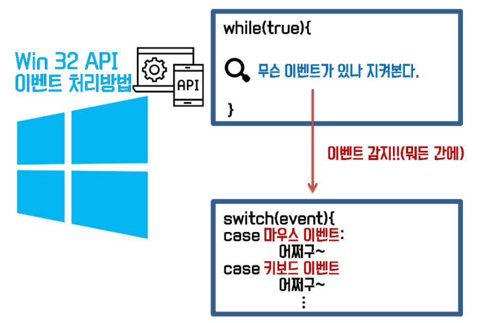
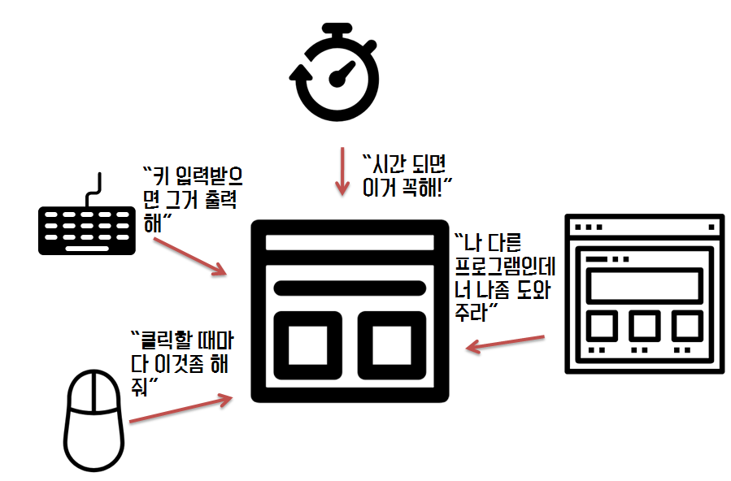
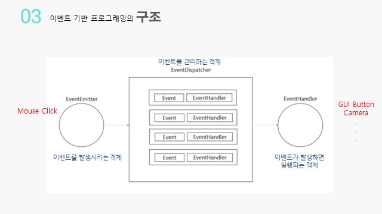
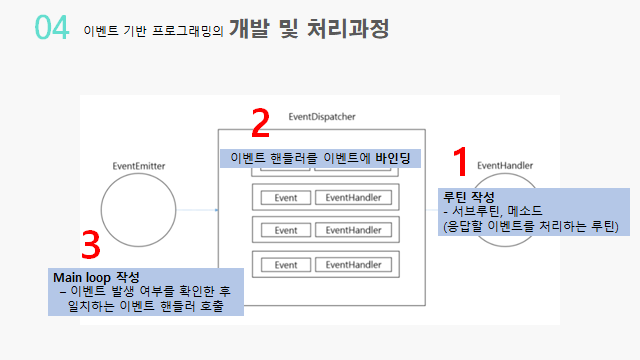
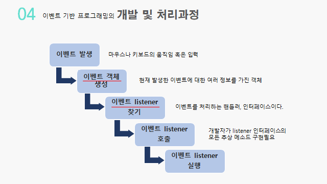

---
ebook:
  theme: one-dark.css
  title: 객체지향
  authors: Escatrgot
  disable-font-rescaling: true
  margin: [0.1, 0.1, 0.1, 0.1]
---
<style>
    h3.quest { font-weight: bold; border: 3px solid; color: #A0F !important;}
    .quest { font-weight: bold; color: #A0F !important;}

    h2 { border-top: 12px solid #67CCCF; border-left: 5px solid #67CCCF; border-right: 5px solid #67CCCF; background-color: #67CCCF; color: #FFF !important; font-weight: bold;}

    h3 { border-top: 3px solid #FFF; border: 2px solid #FFF; background-color: #FFF; color: #0075C4 !important;}

    h4 { font-weight: bold; color: #FFF !important; }
</style>

## 💡 1. 용어 정리
---

### 📄 1. 프로세스 & 스레드

#### 프로세스

메모리에 올라와 실행중인 프로그램
프로그램의 인스턴스

#### 스레드

프로세스 내에서 할동받은 실행의 단위 
경량 프로세스인 Light Weigh Process

#### 프로세스 VS 스레드

스레드는 프로세스 내의 메모리 공간을 공유하지만
각각의 프로세스는 별도의 메모리 공간을 갖습니다.

### 📄 2. 인터럽트(Interrupt)란?, 디스패처(Dispatcher)란?
link : [인터럽트(Interrupt) & 디스패처(Dispatcher)](https://www.crocus.co.kr/1406)

#### Interrupt

* *방해라는 뜻이 아니다.*
* 어떤 장치가 다른 장치의 일을 잠시 중단시키고 자신의 상태 변화를 알려 주는 것이다. 
* 이벤트(Event Invoke)와 동일하다.

#### Dispatcher

* 준비상태(Ready)에서 실행상태(Running)로 상태전이(State Transition)
* 프로세스가 생성되고 Ready상태가 된다.(Ready Queue) 그 후 스케줄러가 Ready Queue에 있는 프로세스 중 하나를 프로세서(CPU)가 사용가능한 상태가 될 때 CPU를 할당해준다.
* 즉 이벤트 핸들러가 Run 하도록 전이시킨다.

#### Event Dispatcher

* 이벤트(Event Invoke) 상태에서 이벤트 핸들러(Event Handler Running)로 상태전이


## 💡 2. EDP : Event-Driven Programming

---

### 📄 1. 특징
#### 이벤트발생에 의해 프로그램 흐름이 결정되는 프로그래밍 패러다임

1. **이벤트** 
   * *예시*
     1. 사용자 입력 : 마우스 드래그, 클릭, 키보드 인풋
     2. 센서의 입력
     3. 네트워크로부터 데이터 송수신
     4. 메시지 수신

2. **메인 루프 Main Loop**
   * EDP기반 프로그램에서 이벤트가 감지되면 
   * 콜백함수를 트리거 하는것
   * 반복적으로 수행된다.
   * 
        |Win32 API의 Main Loop|
        |---|
        |

3. **콜백 함수**
   1. 람다함수, 함수의 인자로 사용되는 1급 객체
   2. 이벤트에 의해 호출되는 함수

### 📄 2. 왜 사용하는건가 ?

#### Single tasking의 단점보완 에서부터 나타난 패러다임이다.

#### 1). 과거에는..
> 과거 개발 방식이나, 현재 들어서 알고리즘 풀때, 
멀티프로그래밍을 사용할 일은 없었고
순차적, 절차적 패러다임만 써도 문제가 없었다.

#### 2). 현재상황
<div align=center>
    <br>현재 들어서는 다음 같은 상황이다.
</div>

> 멀티 프로그래밍에서는 이벤트가 다양하게 발생해서 실행 흐름을 파악하기 어렵다...  
마우스를 어느타이밍에 누를지 모르고, 키보드를 어느 타이밍에 누를지 모른다. 
즉 어떤 예외 사항이 들어올줄알고 그걸 다 미리 준비하느냐.. 
나름 준비했다 하더라도 또 예상 못한거가 들어온다면?

현대 이벤트 기반 프로그래밍들은 main의 역활은 거의 없다고 봐도 무방하고, 이벤트를 만드는데만 초점이 맞춰져 있다.

### 📄 3. 구조

<div align=center>
    <br>이벤트 기반 프로그래밍의 구조
</div>

1. **EventEmitter**
   * 이벤트를 발생시키는 객체
2. **EventDispatcher**
   * 이벤트(Event Invoke) 상태에서 이벤트 핸들러(Event Handler Running)로 상태전이
   * 이벤트를 관리하는 디스패처
   * 이벤트와 이벤트 핸들러를 바인딩 시킨다.
3. **EventHandler**
   * 이벤트가 발생했을때 실행되는 객체

### 📄 4. 개발, 처리과정

<div align="center">
    <h4> 이벤트 기반 프로그래밍의 구조</h4>
    
</div>

#### 개발
**① 루틴(메소드) 작성**
   * 이벤트 핸들러가 되는 콜백함수를 작성한다.

**② 이벤트 핸들러를 이벤트에 바인딩**
   * EventDispatcher를 이용한다

**③ 메인 루프 작성**
   * 이벤트 발생여부를 확인하고, 핸들러를 호출하는
   * 반복적으로 모니터링하는 Main Loop를 작성한다.

<div align="center">
    <h4> 처리과정</h4>
    
</div>

### 📄 5. 예시
#### [이벤트 루프 포함 JS 엔진](../../../웹/JS/프론트엔드지식/자바스크립트CS.md)

### 📄 5-1 JS 예제
#### 1. Inline 방식
* HTML 태그속성으로 지정하는 방식
* 
    ```html
    <html>
        <body>
            <input type="button" onclick="alert(window.location)" value="alert(window.href)">
            <input type="text" onchange="alert(this.value)">
        </body>
    </html>
    ```
#### 2. addEventListener
* 여러개의 이벤트 핸들러를 등록할 수 있다.
*
    ```js
    var t = document.getElementById('target');
    t.addEventListener('click', function(event){
        alert('Hello world, '+event.target.value);
    });
    ```

### 📄 5-2 C# 예제
이벤트와 매서드를 연결시킨다는 점에서 동일.

이벤트 구독 (Event Subscribe) : 이벤트 발생하면 실행하는 콜백쪽
* 이벤트를 구독하기 위해 += 연산자 사용
* 이벤트 구독을 해제하기 위해 -= 연산자 사용

이벤트 발행 (Event Publisher) : 이벤트를 발생시키는것


### 📄 Reference

#### 1. 이론 체득`
1. https://heeonii.tistory.com/3 
2. https://kamang-it.tistory.com/30
3. https://www.youtube.com/watch?v=o2HJCGcYwoU

#### 2. 실제 예시
1. https://jamong-icetea.tistory.com/237
2. https://www.youtube.com/watch?v=pNzN5WF7Uag
3. C# https://docs.microsoft.com/ko-kr/shows/csharp-fundamentals-for-absolute-beginners/understanding-events-and-event-driven-programming
4. C# 이벤트 구독 발행 https://lightgg.tistory.com/15
5. 유니티 https://daekyoulibrary.tistory.com/94
6. 유니티 https://www.youtube.com/watch?v=Cg-ui7wEn7A

#### 3. 심화 이론
0. https://medium.com/dtevangelist/event-driven-microservice-%EB%9E%80-54b4eaf7cc4a
1. https://jaehun2841.github.io/2019/06/23/2019-06-23-event-driven-architecture/#Event-Driven-%EB%9E%80
2. https://medium.com/dtevangelist/event-driven-microservice-%EB%9E%80-54b4eaf7cc4a
3. https://www.confluent.io/designing-event-driven-systems/?utm_medium=sem&utm_source=google&utm_campaign=ch.sem_br.nonbrand_tp.prs_tgt.content-search_mt.mbm_rgn.apac_lng.eng_dv.all_con.deds&utm_term=%2Bevent%20%2Bdriven%20%2Bsystem&creative=&device=c&placement=&gclid=CjwKCAjw1ICZBhAzEiwAFfvFhP2MBmx33hJh2QfDqqhlE9OgwDOVLbO223zfmmVvBSJZa01PqXMVrBoC9SsQAvD_BwE