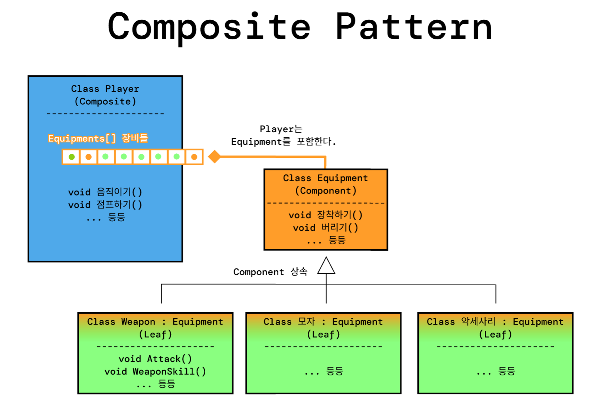
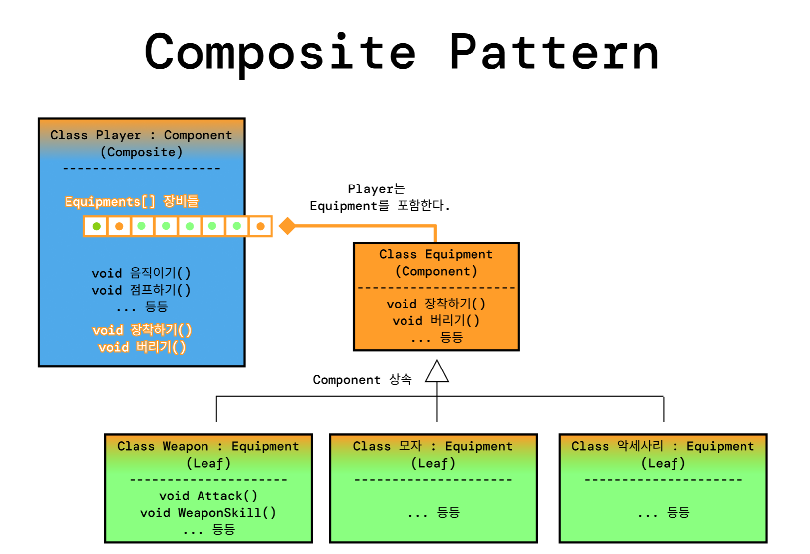

---
ebook:
  theme: github-light.css
  title: 객체지향
  authors: Escatrgot
  disable-font-rescaling: true
  margin: [0.1, 0.1, 0.1, 0.1]
---
<style>
    h3.quest { font-weight: bold; border: 3px solid; color: #A0F !important;}
    .quest { font-weight: bold; color: #A5F !important;}
    h2 { border-top: 12px solid #D40; border-left: 5px solid #D40; border-right: 5px solid #D40; background-color: #D40; color: #FFF !important; font-weight: bold;}
    h3 { border-top: 12px solid #F90; border: 5px solid #F90; background-color: #F90; color: #FFF !important;}
</style>

## 📕 4. 객체지향 디자인 패턴

#### 유니티에서 사용하면 좋을 디자인 패턴만 명시한다.

---

### 📄 0. 사전 지식

#### 1). 응집도와 결합도.
link : [응집도와 결합도](./응집도_결합도/응집도N결합도.md)

### 📄 1. 디자인패턴 개요
#### 1). 디자인패턴 왜 배우나? 
**통계적으로 발생되는 문제 23개 패턴 <br>읽기쉽게 이해하기쉽고 수정하기쉬운 코드로 만들기 위해**

#### 2). 종류 : 이것중 우리는 일부만 배운다. 
1. **생성** 패턴 : 5
2. **구조** 패턴 : 7
3. **행위** 패턴 : 11

#### 3). 아키텍쳐 패턴 VS 디자인 패턴
* **아키텍쳐 패턴** : 시스템 구조에 대한 가이드 라인 
  * 모듈 & 컴포넌트를 어떻게 배치할지
* **디자인 패턴** : 모듈의 세분화된 역활 & 보듈간의 인터페이스를 상세 구현할때 쓰는 가이드 라인

---

### 📄 2. SOLID Principle 
#### 1). SRP (Single Responsibility Principle)
<p align="center">
    
</p>

**ⓐ 단일 책임 원칙**
* 클만변
    1. 클래스 만들때
       * 걔는 단 하나의 책임을 가져야한다
    2. 클래스 변경할때
       * 걔는 단 한가지 이유가 있어야한다

* 높은 응집력과 낮은 결합

**ⓑ 예시**
* [SRP BAD 🤪](./src/SOLID/SRP_BAD.cs)
* [SRP GOOD 😎](./src/SOLID/SRP_GOOD.cs)
* [Python : SRP 비준수와 준수](./src/SOLID/SRP비준수준수.py)

#### 2). OCP (Open-Closed Principle) 

<p align="center">
    
</p>

**ⓐ 확장-폐쇠 원칙**

* 확변
    1. 확장시
       * 열려있어야함
    2. 변경시
       * 닫혀있어야함

**ⓑ 정확한 설명**

* 
    ```text
    1. 새로운 기능을 추가싶을때 있다.
    2. 그런데 추가 시킬때마다 만들었던 코드를 수정해야된다면
    3. 너무 불편하지 않겠나? (애초에 수정이라는 과정에서 버그가 발생하기 마련이다)
    4. 그러지말고 그냥 한줄만 추가해도 기능 확장이 쉬운 구조로 만들자는것
    ```

**ⓒ 예시**
* [OCP BAD 🤪](./src/SOLID/OCP_BAD.cs)
* [OCP 준수 😎](./src/SOLID/OCP_GOOD.cs)
* [Python : OCP 비준수 코드](./src/SOLID/OCP비준수.py)  : <br> Cow와 Sheep을 추가하기위해 hey함수의 수정이 필요하다.
* [Python : OCP 준수 코드](./src/SOLID/OCP준수.py) : <br> 추가되는 동물에 대해 hey함수의 수정을 필요로 하지 않는다

#### 3). LSP (리스코프 Substitute Principle) 
<p align="center">
    
</p>

**ⓐ 리스코프 치환 원칙**
* 상위 클래스가 하위 클래스로 치환될때 문제없이 잘 돌아가야한다.
  * we can use any inheriting class in place of the base class.
* 자식 클래스가 부모클래스의 역할을 제대로 수행 못할때.

* 리스코프 치환이 잘못된 상황
  ```cs
  public class 망치 {
    void virtual 못을박기() {...}
    void virtual 공구상자에넣기(){...}
  }

  public class 귀상어_HammerheadShark : 망치(){
    void override 못을박기(){...}       //귀상어로 못을 박을수가 있나?
    void virtual 공구상자에넣기(){...}  //귀상어를 공구상자에 넣읗수 있나??
    //사용안할 메소드를 받는게 잘 된건가?
  }

  public class 목공 {
    public void 연결(못, 망치, 나무들){
      만약... 인수 타입이 "귀상어_HammerheadShark"라면?
      귀상어로 망치질 할수 있나?
    }
  }

  static void Main(String argv){
  }
  ```

* **[LSP 예시](./src/SOLID/LSP준수비준수.py)**

#### 4). ISP (Interface Segregation Principle) ❓

<p align="center">
    
</p>

**ⓐ 인터페이스 분리 원칙**

커버져린 인터페이스 사용시 사용하지도 않을 인터페이스가 
클래스로 들어오게 된다면?..

* 뚱뚱한 인터페이스를 사용 해서는 안된다.
  * 클라이언트는 사용하지도 않을 메소드들에게
의존하게 해선 안된다 인터페이스를 더 작은 단위로 나누자
  * 
  * 
    ```text
    1. 자동차 인터페이스는 
         * 자동차 인터페이스 클래스만
    2. 보트 인터페이스는 
         *  보트 인터페이스 클래스만
    3. 만약 양육자동차려면
         * 자동차 보트 인터페이스 둘다 가져오기
    ```

**ⓑ 예시**
* **[Python : ISP 준수 비준수](./src/SOLID/ISP준수비준수.cs)**

#### 5). DIP (Dependency Inverse Principle) ❓

<p align="center">
    
    
</p>

**ⓐ 의존 역전 원칙**

* "추상화에 의존하라"
  * 구체적인 개념보다는 추상적인 개념에 의존해야 한다.

* 변동성이 큰 클래스로부터 파생하지 말자, 대신 추상 팩토리로 파생하여 확장성을 높이자
* 서브클래스에서는 추상 메소드를 구현하거나, 훅 메소드를 오버라이드하는 방법을 이용해 기능의 일부를 확장합니다.

**ⓑ Hook 메소드 란?**
  1. *[1) Virtual 하게 정의]* 해두거나 *[2) 비워진 (추상적으로)]* 수퍼 클래스에 정의된 메소드이며,

* 특정 구현에 대한 종속성을 줄여야 하지만 인터페이스에 의존해야 합니다.

**ⓑ 예시**
* [DIP_BAD 🤪](./src/SOLID/DIP_BAD.cs)
* [DIP_GOOD 😎](./src/SOLID/DIP_GOOD.cs)
* [Python : DIP_비준수](./src/SOLID/DIP비준수.py)
* [Python : DIP_준수](./src/SOLID/DIP준수.py)

---

### 📄 3. 생성 패턴

<div align="center">
  <h4> 생성과 참조과정을 캡슐화 하여 객체가 생성되거나 변경되도 <br>
  시스템에 영향을 크게 받지 않도록 프로그램의 유연성을 더해주는 패턴</h4>
</div>

#### 1). Singleton pattern

<p align="center">
    
</p>

**ⓐ 특징**

1. 전역적으로 접근 가능한 객체라 어디에서든지 참조할 수 있다.
2. ***인스턴스가 오직 단 하나를 상성함을 보장***, 불필요한 메모리 낭비를 최소화 할 수 있다
3. 너무 남용하면 다른 클래스의 인스턴스들 간에 결합도가 높아져 개방 폐쇠 원칙이 위배될 수 있다.

**ⓑ 사용하는 이유**
* 전역적으로 사용되는 데이터, 리소스를 수시로 접근해야 할때
* GameManager 힘들게 지정하는 대신 쉽게 Static으로 접근 가능

**ⓒ 다음과 같은 목적에 사용하기를 권한다.**
1. *환경설정*
    * Audio Manager
2. *Save & Load*
    * 단 동기화 문제가 없을시.
3. *Camera* : <sub>사실 이미 유니티에 Camera.main으로 구현되어있음</sub>
4. *EventSystem* : <sub>사실 이미 유니티에 구현되어 있음</sub>
5. *Pool* : 싱글톤 GameObject를 생성해서 사용. GameLoop가 없는 객체로만.
    ```cs
    public class _className_ : monoBehavier {
      private static _className_ _instance;

      public static _className_ Instanace {
        get{
          if(_instance == null){
            var obj = FindObjectType<_classNmae_>();

            if(obj != null){_instance = obj}
            else if(obj == null) {
              var newObj = new GameObject().AddComponent<_className_>();
              return _instance;
            }
          }
        private set;
        }
      }
    }
    ```

**ⓓ 사용해서는 안되는 상황**
1. 플레이서, 몹, 이펙트
   * 개발 과정에서 결합도가 높아지는 경우가 있음
   * 게다가 Static 변수는 디버깅 트랙하기 힘들다 즉, 어디서 일어난 버그인지..

**ⓔ 구현**
1. **자기 자신을 참조하는 인스턴스로 구성됨**

2. **동시성 문제** : 싱글톤 생성이 느리면 모든 쓰레드가 거의 동시에 도착하고
이로인해 서로가 null 객체를 바라보기 때문에 쓰레드들이 **객체를 두번 생성할 수 있다**.
   * 인스턴스가 하나만 있기를 보장해야하는데 불구하고..;
   * ***해결책 : Thread-Safe 가 보장되어야 한다.***
* 
  ```cs
  public class LazySingleton {
    private static readonly Lazy<LazySingleton> _instance
      = new Lazy<LazySingleton>(() => new LazySingleton());

    public static LazySingleton Instance {
        get { return _instance.Value; }
        // _instance는 Lazy 객체 이므로 실제 인스턴스는 Value에 있다. 
    }
    private LazySingleton() { }
  }
  ```

1. **프레임 드랍** : 필요할 때 초기화하는 Lazy 기법. 하지만 전투 도중에 시스템 초기화 작업을 수행한다면 중간에 프레임이 떨어지거나 게임 화면이 뚝뚝 끊길 수도 있다. 가능하면 로딩 씬에서 이를 모두 초기화한다면 게임 플레이에 영향이 적을 테니 좋을것
   * **시작과 동시에 정적 변수를 초기화**
   * 오브젝트 풀을 응용 하여 사용하면 괜찮을수 있음

* 
  ```cs
  public class Singleton {
    private static readonly Singleton _instance = new Singleton();

    public static Singleton Instance {
      get {
          if(_instance == null) return new Singleton();
          return _instance;
      }
    }
  }
  ```

---
### 📄 4. 구조 패턴


<div align="center">
  <h4>클래스나 객체를 조합하여 더 큰구조로 만드는 패턴 </h4>
</div>

#### 1). Composite Pattern

<p align="center">
  
</p>


**ⓐ 쓰는 이유?**
1. 여러 개체를 동일한 목적으로 사용하고 있으며 각 개체를 처리하는 코드가 거의 동일한 경우 컴포지트를 사용하는 것은 좋은 선택이다.
2. 칼이면 휘두루고, 총이면 방아쇠를 당기는등. 컴포지트와 각기다른 객체의 차이를 무시하고 **어쨌든 공격한다는 점**에서 같은 동작처럼 사용하고 싶을때. <sub>*Composite should be used when clients ignore the difference between compositions of objects and individual objects*</sub>
3. 트리 계층 구조에서 상속이 가지는 문제를 해결해준다. part-whole hierarchies 
   * [😨 트리 구조에서 상속의 문제점 *(우리가 굳게 믿었던 상속이 사실 개 트롤일수도 있다..)* 😨](./IsA_HasA/상속의문제.md)

**ⓑ 구성요소**
|Case 1|Case 2|
|---|---|
|||
1. **Component** : 추상클래스 또는 인터페이스다.
2. **Leaf** : *Leaf*는 *Component* 의 파생 클래스이다.
3. **Composite** : 다른건 몰라도... 다음이 포함된다.
    1. Component 인스턴스를 담는 컨테이너 (List, Dictionary)
        ```cs
        private List<Component> components = new List<Component>();
        ```
    2. Component 컨테이너를 추가하거나 삭제하는 매서드
        ```cs
        public addComponent(Component _c) {
          components.Add(_c);
        }
        ```
    


**ⓑ 예시**
* [Composite Pattern (C#)](./src/Design/Composite.cs)
* [Composite Pattern 2 (C#)](./src/Design/Composite2.cs)

#### 2). Decorator Patterns


<p align="center">
  
</p>

**ⓐ 특징**
* 객체의 기본 기능에 추가 기능을 덧붙여 결합 & 장착할 수 있다. 
* 즉 객체를 런타임 동안 동적으로 변화시킬수 있다.

**ⓑ 왜 쓰는가?**
* 기능 확장성
  * 기존 코드를 수정하지 않고도 데코레이터 패턴을 통해 행동을 확장할수 있다.
* 동적 확장성
  * 구성과 위임을 통해서 실행중에 새로운 행동을 추가할 수 있습니다.

**ⓒ 구성요소** 
1. **Component**
    * 인터페이스 또는 추상클래스가 된다.
    * 기본 기능을 정의한다.
2. **ConcreteComponent**
    * 기본 기능이 되는 인스턴스가 된다. 데코가 붙을 대상
    * *Component*를 상속한다.
3. **Decorator**
    * 데코가 붙을 대상을 포함한다. 
    * *ConcreteDecorator*의 form을 제공함 ConcreteDecorator가 생긴다면 다 Decorator와 비슷하게 생김
    * 추상클래스다
4. **ConcreteDecorator**
    * 객체에 *ConcreteDecorator*기능을 추가하고싶을때 
    *ConcreteDecorator* 생성자에 객체를 넣는다 그럼 행동이 추가된다.

**ⓓ 단점**
* 데코레이터를 너무 많이 사용하면 코드가 필요 이상으로 복잡해 질 수 도 있다.  

#### 3). 플라이 웨이트

* 다수의 유사객체를 사용하거나 조작할떄 유용
* 인스턴스가 필요할 때마다 매번 생성하는것이 아닌 가능한 공유를 통해 사용함으로 메모리를 절약하는 패턴

---

### 📄 5. 행동 패턴

클래스와 객체간 서로 상호작용하는 방법이나 책임 분배 방법을 정의
하나의 객체로 수행할 수 없는작업을 여러 객체로 분해하면서 결합도를 낮출수 있음

#### 1). ✨ Command ✨
* Express actions for actors as classes.
* 실행될 기능을 캡슐화함으로써 주어진 여러 기능을 실행할 수 있는 재사용성이 높은 클래스를 설계하는 패턴
* 요청을 객체 형태로 캡슐화 하여 재이용하거나 취소 할수 있도록 
필요 정보를 저장하거나 로그에 남기는 패턴
* 요청에 사용되는 명령어를 추상클래스나 구체 클래스로 분리하여 단순화 시킴

#### 2). ✨ Observer ✨
* An object, called the subject, maintains a list of its dependents, called observers, and notifies them automatically of any state changes.
* 한 객체의 상태 변화에 따라 다른 객체의 상태도 연동되도록 일대다 객체 의존 관계를 구성하는 패턴
* 한 객체의 상태가 변화하면 객체에 상속되어 있는 다른 객체들에게도 변화된 상태를 전달하는 패턴
* 주로 분산된 시스템간에 이벤트를 생성 발행하고 이를 수신해야할떄 이용함

#### 3). State
* 객체의 상태에 따라 객체의 행위 내용을 변경해주는 패턴
* 객체의 상태에 따라 동일한 동작을 다르게 처리해야할떄,
* 객체 상태를 캡슐화 하여 이를 참조하는 방식

---

### 📄 6. 그밖에 Unity에 유용한 패턴

#### 1). ✨ Subclass Sandbox ✨ : Behavioral Patterns

<p align="center">
  
</p>

#### 상위 클래스가 제공하는 기능들을 통해서 하위 클래스에서 행동을 정의한다.

**ⓐ 특징**

\# abstract & override #protected #subclass

1. 실제 구현부, 메인이 되는 객체가 파생클래스다.
2. 그럼 상위클래스가 제공하는것은 뭔가? 
   * 상위 클래스는 하위 클래스가 필요로 하는 기능을 전부 제공할 수 있다.
   * 상위 클래스는 하위 클래스용 메소드인 **Sandbox 메소드**를 제공한다.

3. ***sandbox*** 가 의미하는것.
    * 추상 원시 메소드.
    * protected로 만들어져 하위 클래스용이라는 걸 분명히 한다.
    * 하위 클래스에서 구현할때 아무 코드나 넣으면서 마음대로 구현할 수 있다.

**ⓑ 왜 쓰는건가?**

\# decouping #재사용성

***샌드박스 패턴은 이럴 때 좋다. :***

1. 클래스 하나를 잡고 많이 상속해야할때.
   * 유사한 클래스들을 파생클래스로 구현해야할때
2. 하위 클래스 한번 훑는데 어? 은근 기능 겹치는게 많음, 
겹치는 기능을 상위 클래스로 올려보내
하위 클래스끼리 쉽게 공유하고 싶을때. 
그럼으로 상위클래스는 하위클래스가 수행해야할 동작을 전부 제공한다.

1. 외부 코드간 커플링 감소
커플링을 상위 클래스에 몰아 놓아 하위 클래스가 필요로 하는 모든 기능을 상위 클래스에서 제공한다. 
   * 하위 클래스는 상위 클래스와만 커플링 될 뿐, 그 외 외부 시스템에는 전혀 접근하지 않는다.
   * 즉, 상위 클래스 외 다른 잡다한 외부 코드를 끌어들일 필요가 없다는 얘기 오직 소통해도 상위 클래스로만 소통한다

**ⓒ 주의 사항**
컴포지트 패턴에서 지적한 상속의 문제
1. 상위 클래스에 코드가 계속 쌓이는 경향이 있다. 특히 하위 클래스 샌드박스 패턴에서는 그럴 여지가 많다.

2. '깨지기 쉬운 상위 클래스' 문제

**ⓒ 구현**
1. [메서드를 직접 제공](./src/Design/SubclassSandbox.cs)
2. [컴포넌트 객체를 통해서 제공](./src/Design/SubclassSandbox2.cs)
3. [서브클래스 샌드박스로 몬스터 구현](./src/Design/SubclassSandbox/Monster.md)
#### 2). Event queue : Decoupling Patterns
* Decouple when a message or event is sent from when it is processed.

#### 3). ✨ Object Pool ✨ : Optimization Patterns
* Improve performance and memory use by reusing objects from a fixed pool instead of allocating and freeing them individually.

---

### 📄 6. 참고

1. [코드없는 프로그래밍 SOLID](https://www.youtube.com/watch?v=jlQkWM7Tu7o&list=PLDV-cCQnUlIZcWXE4PrxJx6U3qKfRTJcK&index=1)
2. https://github.com/accesto/solid-php
3. https://accesto.com/blog/solid-php-solid-principles-in-php/

4. https://korstrix.github.io/index/Index/
5. https://github.com/Habrador/Unity-Programming-Patterns
6. https://csharpindepth.com/articles/singleton
7. https://gameprogrammingpatterns.com/contents.html

[싱글톤 개요](https://cjw-awdsd.tistory.com/42)
[싱글톤 c#](http://egloos.zum.com/sweeper/v/3157853)
[싱글톤 c#](https://nochoco-lee.tistory.com/676)
[Master Singleton: in unity the right way](https://gamedevbeginner.com/singletons-in-unity-the-right-way/)
[Master Singleton Video](https://www.youtube.com/watch?v=tcatvGLvCDc)
[컴포 패턴](https://www.youtube.com/watch?v=XXvrHAsfTso)
[컴포 패턴](https://8iggy.tistory.com/238)
[컴포 패턴](https://en.wikipedia.org/wiki/Composite_pattern)
[샌드박스](https://teamalphaaleph.wordpress.com/2016/03/03/subclass-sandbox-an-introduction/)
데코레이터
[서브클래스 샌드박스](https://lipcoder.tistory.com/140)
[서브클래스 샌드박스](https://teamalphaaleph.wordpress.com/2016/03/03/subclass-sandbox-an-introduction/)
[서브클래스 샌드박스](https://www.habrador.com/tutorials/programming-patterns/11-subclass-sandbox-pattern/)
[서브클래스 샌드박스](https://teamalphaaleph.wordpress.com/2016/03/03/subclass-sandbox-an-introduction/)