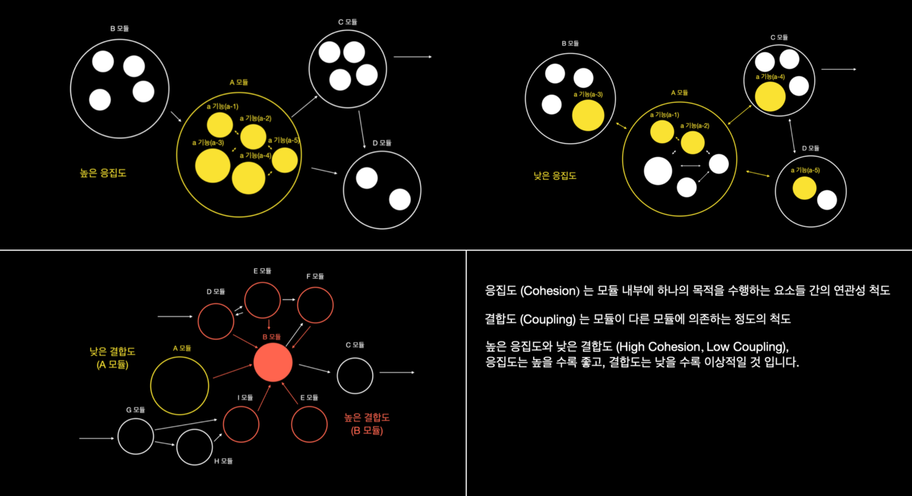

---
ebook:
  theme: github-light.css
  title: 객체지향
  authors: Escatrgot
  disable-font-rescaling: true
  margin: [0.1, 0.1, 0.1, 0.1]
---

응집도와 결합도

## 응집도
* 모듈내부 요소들간의 연관성 척도
* 모듈 내부의 기능적인 응집 정도를 나타냄
* 높을 수록 좋아요 ❤️

A모듈이 아닌 곳에 a 기능 들이 흩어져 있다던가 또는 A 모듈에 a 기능 외에 b, c, d 기능들도 섞여서 복잡하게 구현되어 있다면 수정하기가 힘들겠죠.

## 결합도
* 모듈이 다른 모듈에 의존하는 정도의 척도
* 참조대상의 참조Degree가 얼마나 되는지..
* 낮을 수록 좋아요 ❤️

결합도가 높으면 변경하고 검토해야되는 모듈 수가 많아지는 단점이 있으니, 결합도는 낮을수록 검토해야되는 소스의 수가 적어져서 코드를 수정하기가 쉬워집니다.