---
ebook:
  theme: github-light.css
  title: 객체지향
  authors: Escatrgot
  disable-font-rescaling: true
  margin: [0.1, 0.1, 0.1, 0.1]
---
<style>
    h3.quest { font-weight: bold; border: 3px solid; color: #A0F !important;}
    .quest { font-weight: bold; color: #A5F !important;}
    h2 { border-top: 12px solid #D40; border-left: 5px solid #D40; border-right: 5px solid #D40; background-color: #D40; color: #FFF !important; font-weight: bold;}
    h3 { border-top: 12px solid #F90; border: 5px solid #F90; background-color: #F90; color: #FFF !important;}
</style>

## 📕 5. NDC의 협업 문화

---

### 📄 1. 코드 리뷰

#### 1). 업무 분할
**① 자신의 일을 잘라서 나누자**
* 내가 충분히 알고 있는 일을 나누자 

**② 나눌때, How to를 자세히 설명하자.**
* 개발 도구 세팅, 사용법
코드를 어디를 봐야하는지
어떤 구조로 문제를 풀면 되는지
쉬운일 부터 완수해야하고 그걸 동료와 공유해야한다.

**③ 결과물 확인과 검증 그리고 피드백**

* 피드백은 일관성 있어야 하고, 근거도 명확해야된다.
* 한번에 모든 규칙을 숙지하기 어렵기에 ***정리된 문서*** 가 필요하다.
   ```text
   1. 파일, 코드, 클래스명 등등 네이밍 컨벤션
   2. 실행 방법 & 깃허브 공유법 등등..
   3. 디자인 패턴
   4. 델리게이트 네이빙, 호출 컨벤션
   5. 에러메시지 컨벤션
   ```

---

### 📄 2. 설계 리뷰

1. 기획 사항과 제약 사항을 이해하고 작업을 설계(아키텍처) 해보자
2. 설계 근거를 확인하고 타당성을 검토한다
   * 예상되는 문제를 찾아내고 다른 의견을 제시해본다.
   * 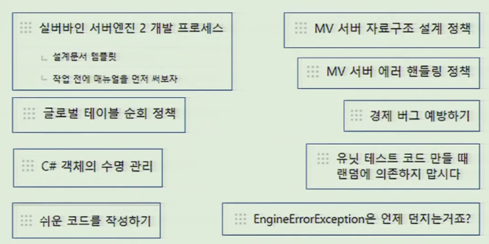

3. 이렇게 함으로 사고의 흐름, 가치간의 우선순위를 매기고,
성능 품질 기준의 설정과 비용분석이 가능하다.
4. 설계를 핑퐁하면서 설계를 완성해나가자.

---

## 📕 6. 아키텍처

---

### 📄 1. 아키텍처 개요

<div align="center">
	<p>🔻관련 유튜브를 보려면 사진 클릭🔻<p>
	<a href="https://www.youtube.com/watch?v=saxHxoUeeSw"></a>
	<h4>아키텍처에 대한 영상 - 배달의 민족</h4>
</div>


|꼬인 상황|(나름) 정돈된 상황|
|:--|:--|
|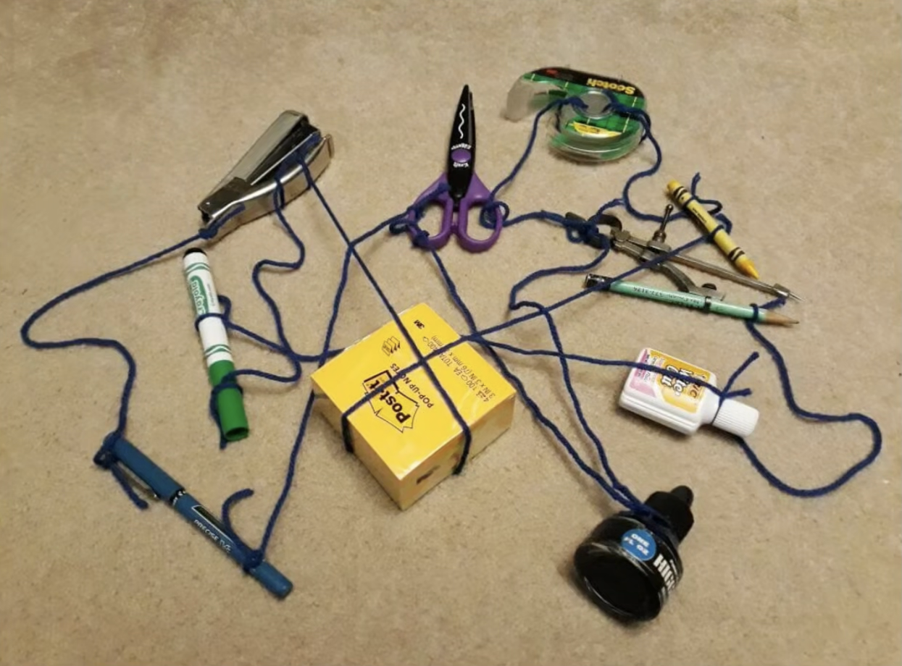|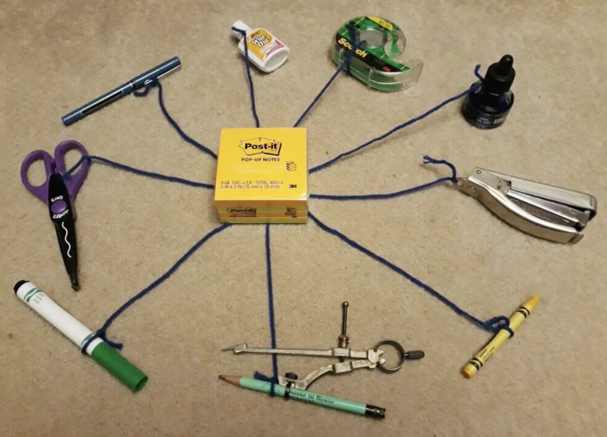|

#### 1). 아키텍처는 왜 신경쓰는건가? 

> **아키텍처란?** 소프트 웨어 설계도를 구축하는 방법이다. 소프트 웨어 요소간의 관계 정보, 연관성을 만들어내는 구조를 정의하며, 시스템 요소의 행위는 다른 시스템 요소와의 상호 작용 방법을 제시한다. 시스템을 최상위 수준으로 추상화 한다.


#### 2). 이 문서를 통해 배울 수 있는것

> 1. **설계에 익숙치 않은 개발자도** 설계 작업을 수행할때 아키텍쳐 설계 절차를 적용해 **아키텍쳐를 만들 수 있다.**
> 2. 설계, 구축, 검증을 통하여 **시스템의 품질을 높이는데** 도움이 된다.
> 3. **기능적 요구사항을 구현하는데 초점을 맞춘다.** <br> "시스템 품질 & 아키텍처 품질" (비기능적 요구사항) 을 가능한 지켜가며

#### 3). 어떻게 사용해야 적절한가?

비즈니스적 성공에 기여하지 못한다면 오히려 아키텍쳐는 낭비일 수 있다.
우리 프로젝트에서는 다음 상황을 숙지하며 설계를 고려해야할것 같다.

> 1. 아키텍처는 팀원간 **의사소통 수단**이며 개발 초기설계 의사결정에 대한 설명서이다.
> 2. 미래의 **환경 변화에 대한 내용을 고려**한다.
> 3. **기획에 서술된 기능을 구현, 갖추는데** 사용

#### 4). 그래? 그럼 한번 만들어봐

**① 뭐가 필요한데**
* 인풋 : 기획서
   1. **기능적 요구사항**
   2. 비기능적 요구사항 (비즈니스 제약 사항 & 품질 요구사항)

**② 뭐로 만들고 어떤 아웃풋이 나오는가?**
1. 아웃풋 
   * 개발 대상 시스템의 아키텍처
   * 유지보수및 관리에 도움을 주는 가이드라인
2. **기능적 요구사항**
   * 유스케이스 다이어그램 & 시나리오
3. 비기능요구사항
   * 품질 속성의 분류

**③ 아키텍처의 작성 절차**
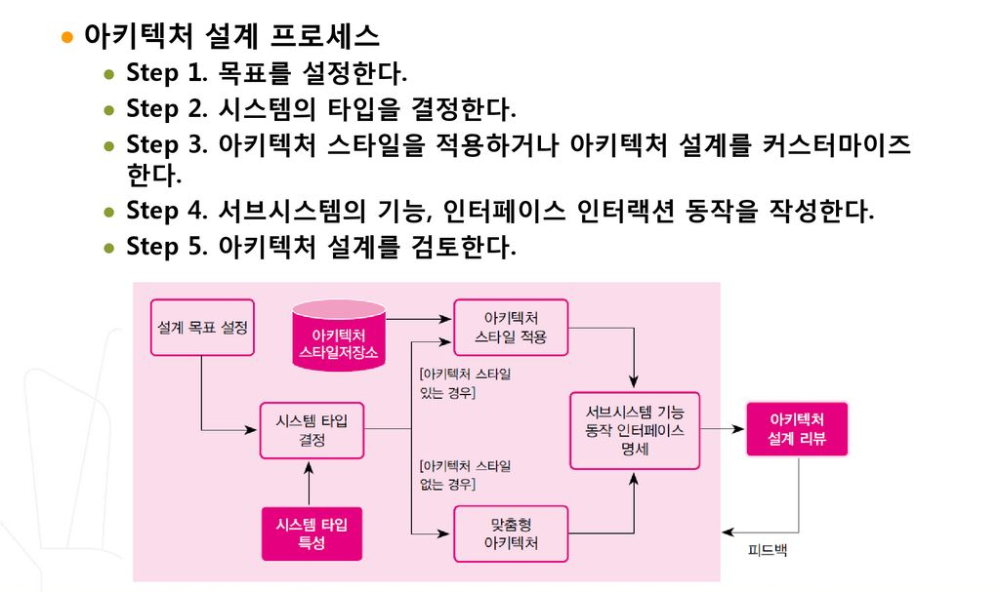

*
   ```text
   ▶︎ 일반적 : 
      1. "설계 목표 설정" ->
      2. 시스템 타입 결정" -> 
      3. "아키텍처 패턴" -> 
      4. "서브 시스템 기능과 인터페이스 동작 구체화" -> 
      5. "아키텍처 설계 검토"
   ```

---

### 📄 2. 아키텍처 용어 정리

#### 1). 컴포넌트 = 모듈
* 시스템을 구성하는것, 데이터를 저장하는것, 다른 컴포넌트를 연결하는 특수한 케이스도 있다.
* 명백한 역할을 가지고 있으며, 독립적으로 존재 할 수 있는 시스템의 부분이다.
* 외부와 결합이 낮고 내부 요소가 응집되도록 구현하길 권장한다.

#### 2). 커넥터 
* 컴포넌트간 상호작용을 실행시키는 요소
ex). Procedure call 또한 커넥터다.

#### 3). 인터페이스
* 컴포넌트와 커넥터 사이의 입력, 리턴값의 타입
* 별개의 시스템과의 호완성과 관련이 있다.


#### 4). 관점 
* **시스템을 포착하기위한 시각**
   1. *논리적 관점*  : (컴포넌트-연산혹은처리수행 / 커넥터-단순히그걸연결하는요소)
   2. *모듈 관점*    : (컴포넌트-모듈 / 커넥터-모듈간연결관계)
      * UML 어떤 코드 모듈로 구성하고 그들이 어떻게 연결되어야하는지 보이는 관점
      * ***Aggregation 혹은 Composition*** / ***Dependency*** / ***Generalization 혹은 Subclass 관계***
   3. *실행 관점*    : (컴포넌트-프로세스스레드메모리 커넥터-이들을연결하는상호작용방식)

#### 5). 뷰
* **그 관점에서 본 시스템의 모습**
   |View의 응용법|
   |---|
   |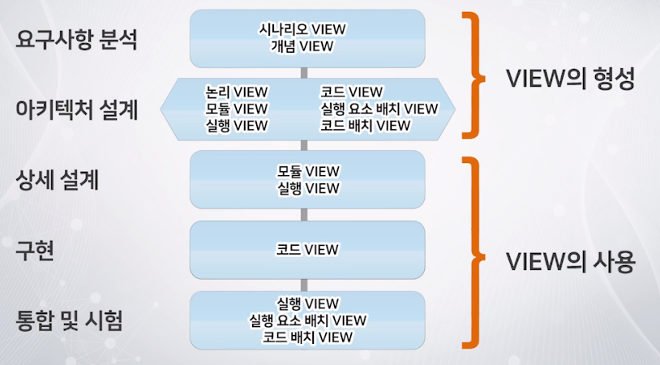|

---

### 📄 3. 품질 속성과 시나리오

#### 1). 어떻게 만들어야 잘만든것일까?
**① 시스템 품질 속성**

* 
   ```text
   ▶︎ | 변경 용이성 | 시험 용이성 | 성능 | 보안성 | 사용 편이성 | 가용성 |
      ----------------------------------------------------
   ▶︎ 변경 용이성
      1. 모듈화 : 시스템의 수정 및 재사용, 유지관리등이 용이하도록 시스템의 기능을 모듈단위로  나누는것이다.
      2. 추상화 : 더 단순한 인터페이스를 제공한다. 구조파악에 용이하다. 
         추상화의 유형으로는 과정(흐름), 구조(데이터), 제어(이벤트) 
         이를통해 단계적 분해를 진행하자
      3. 종속성 최소화 & 의존도 최소화

   ▶︎ 시험 용이성
      4. 쉬운 테스트 & 디버깅

   ▶︎ 성능
      5. 알고리즘
   ```

**② 비즈니스 품질 속성**

* 
   ```text
   ▶︎ 이번 프로젝트에 고려할점 다음정도 될것 같다.
      1. 데드라인
      2. 비용(인력)과 이익
      3. Life Cycle
   ```

**③ 아키텍처 품질속성**
1. **일관성**
2. **정확성과 완전성**
3. **개발 용이성**

---

### 📄 4. 실제 수립 과정

* 아키텍처는 한번에 만들어지는게 아니라
초기 아키텍처도 있고, 다음 아키텍처를 만드는데 구체적인 요구사항을 파악하는데 이용하기도한다.
그러면서 설계와 동시에 변경및 추가가 수시로 일어나게된다.

* 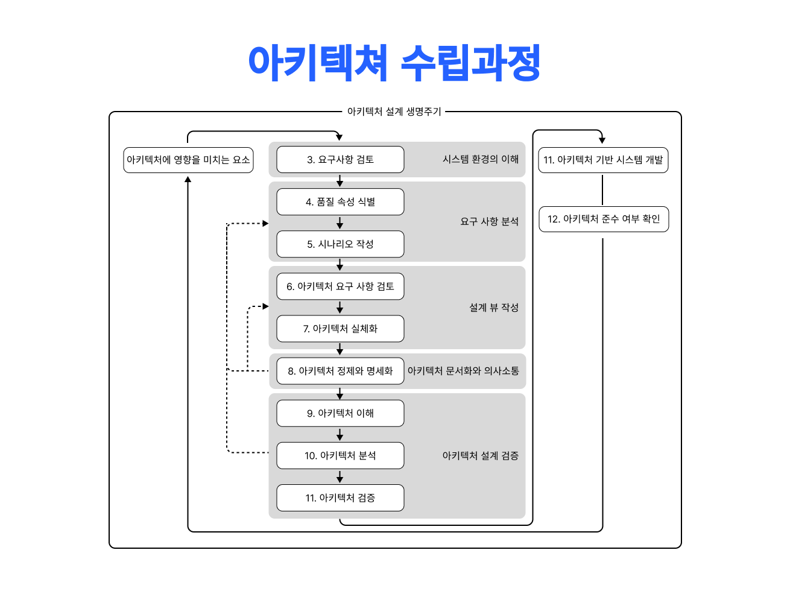

---

### 📄 5. 시나리오 도출
#### 1). 기능 요구사항 유스케이스 시나리오
기능 요구사항 : 입력을 받아들여 출력을 하는 기능을 만드는것이다.

유스케이스
* 사용자 중심 요구사항 모델링
  * 유스케이스 & 액터간 상호작용을 통해 시스템을 분석한다.
  * Diagram 으로 요구사항 이해하자
* ATM 시스템 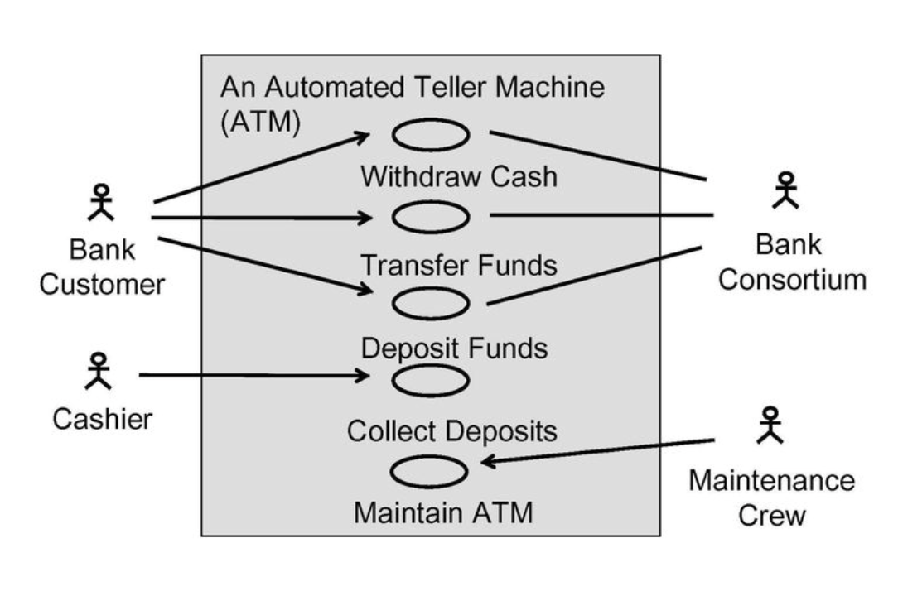
```text
UC_0001 : Withdraw cash
1. 설명 : 
   고객이 ATM으로부터 자신의 계좌에 입금되어있는 돈을 출금한다.
2. 이벤트 흐름 : 
   a. 기본 흐름
      1. ATM은 고객의 유효성을 확인하기위해 Chack Validity 유스케이스를 포함한다.
      2. ATM은 사용자에게 인출 금액 입력화면을 출력한다.
      3. 사용자는 ATM에 인출금액을 입력한다.
      4. ATM은 카드를 꺼내어 사용자에게 돌려준다.
      5. ATM은 사용자에게 영수증 발급 여부를 물어본다
      6. ATM은 사용자에게 영수증을 발급해준다.
      7. ATM은 사용자에게 돈을 지급한다.
      8. ATM은 초기화면으로 돌아간다.
   b. 대안흐름
   c. 예외흐름
3. 조건 : 
   선행조건
   후행조건
4. 기타
```

#### 2). 품질 속성 시나리오

1. 인풋 기획서 / 아웃풋 도출된 시나리오 목록
2. 리뷰하면서 시나리오를 도출
3. 시나리오 우선순위화

---

### 📄 6. 뷰 설계

https://www.youtube.com/watch?v=TxiQ1orXz8g&list=PL7mmuO705dG0IAIxnSGZ3N-HsvyA45lte&index=15

<div align="center">
   <p>아키텍쳐 프레임워크</p>
	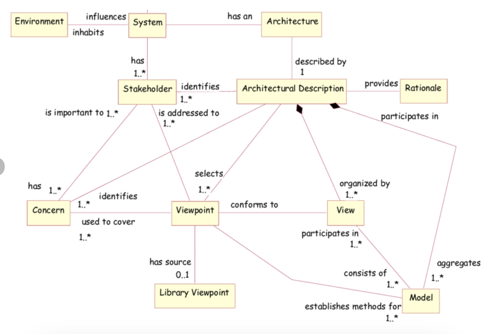
	<h4>"뷰"는 아키텍처를 도면의 형태로 표현하기위해 사용된다.<br><sub>아키텍처는 관점과 뷰와 관계를 맺는다.</sub></h4>
</div>

#### 1). 뷰 모델
아키텍처를 표현하는데 사용하는 모델이다
아키텍처를 표현하는 뷰 관점은다양하다.. 대표적인 뷰모델을 얘기하자면

① Siemens Four view
② RUP (4+1) Model : UsedCase 기반 모델
**③ UML 2.0 ViewModel**

<div align="center">
    
</div>

* 중요한것들
   1. [클래스](youtube.com/watch?v=UI6lqHOVHic)
   2. [시퀸스](https://www.youtube.com/watch?v=pCK6prSq8aw&list=PLUoebdZqEHTxpGCwKrb82cIvHNoNaBb4R&index=3)
   3. [유즈케이스](https://www.youtube.com/watch?v=zid-MVo7M-E)

**④ SEI View Model**

<div align="center">
    
</div>

* 중요한 것들
  1. 모듈뷰
  2. 컴포넌트&커넥터 뷰
  3. 할당뷰

1. **모듈뷰 : 정적인 뷰 & 코드 구조**
   * 각 모듈은 기능적인 책임만 표현한다. 
   *
      |클래스 다이어그램|분할 뷰|사용 뷰|상속 뷰|레이어 뷰|
      |:--|:--|:--|:--|:--|
      ||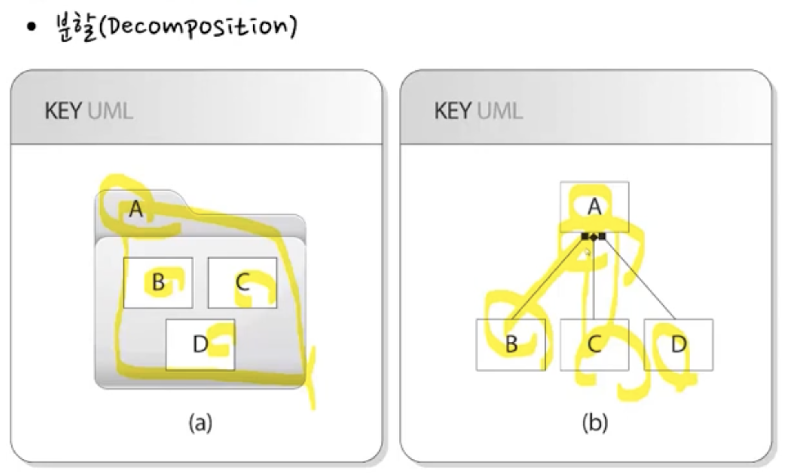|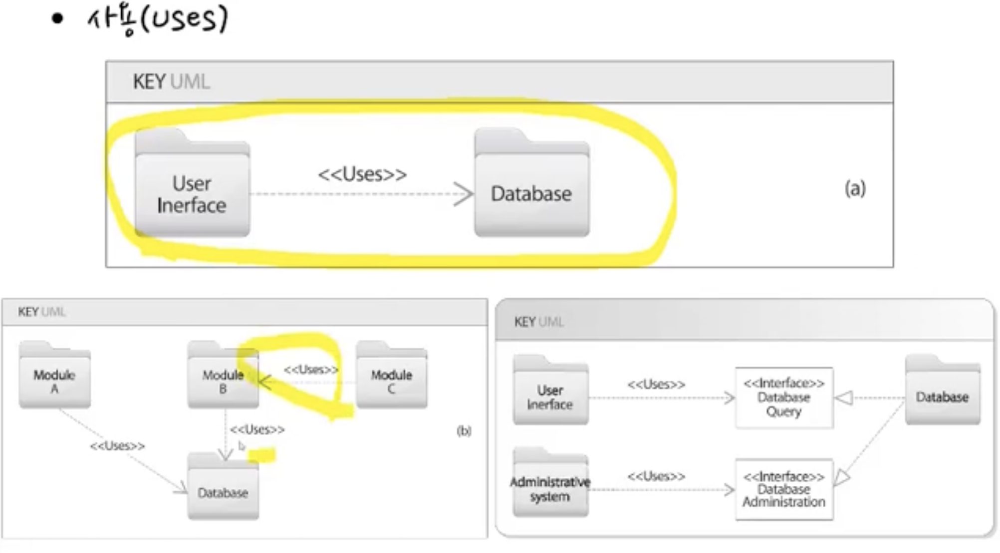 |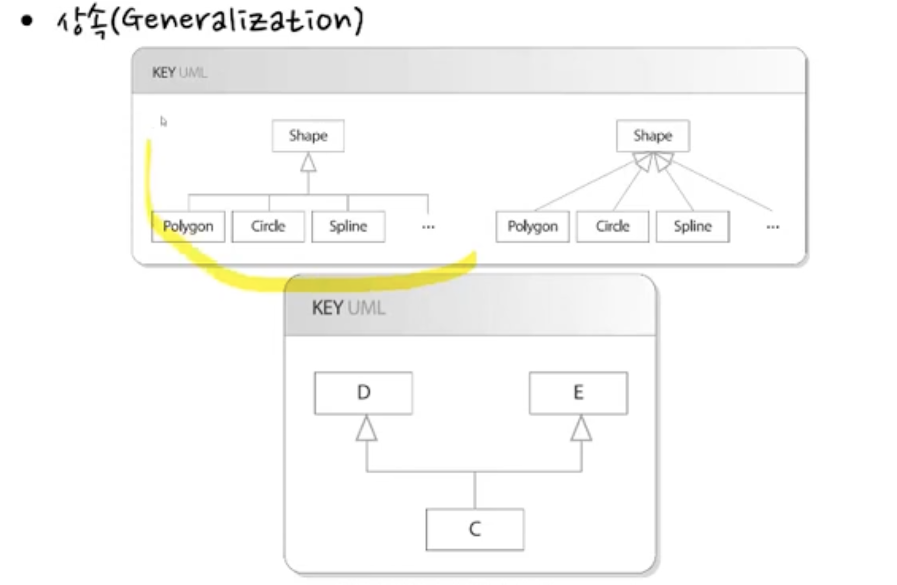 |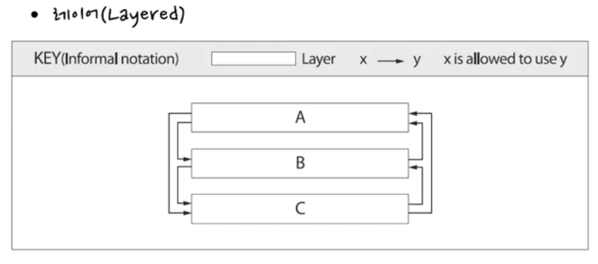 |

2. **컴포넌트&커넥터 뷰 : 동적 뷰 & 런타임 구조**
   * 런타임, 실행시점 흐름,"데이터, 통신"의 흐름을 표현한다. 
   * 특징은 인풋, 아웃풋 포트가 존재한다.
   *
      |시퀀스 다이어그램(파이프&필터)|공유데이터 뷰|발행 구독 뷰|
      |:--|:--|:--|
      |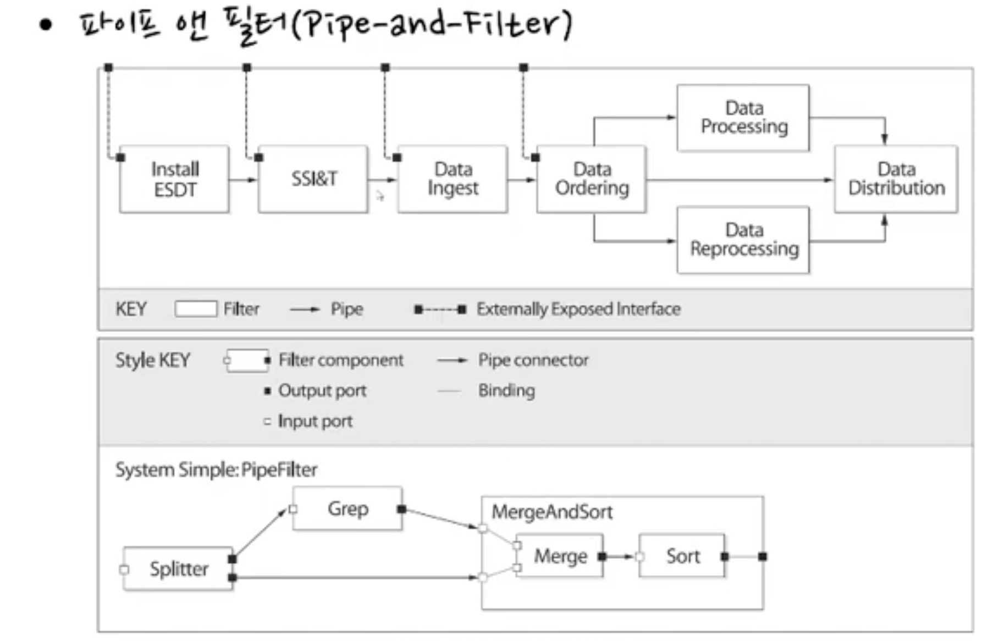 |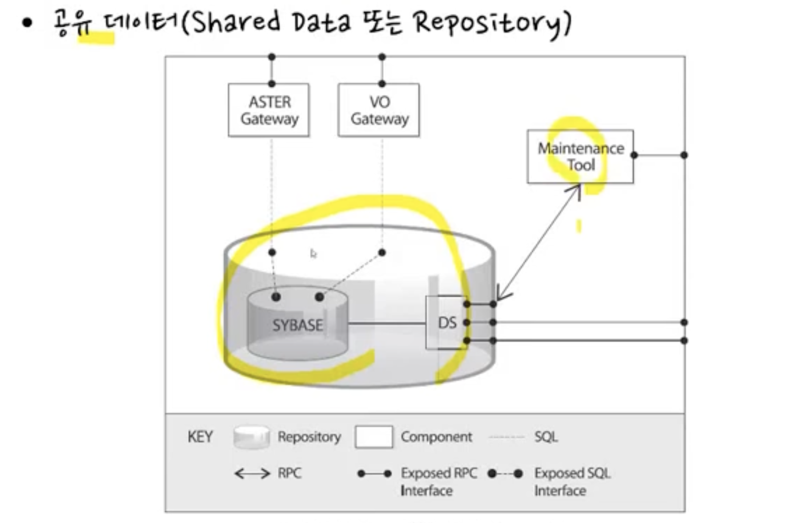 |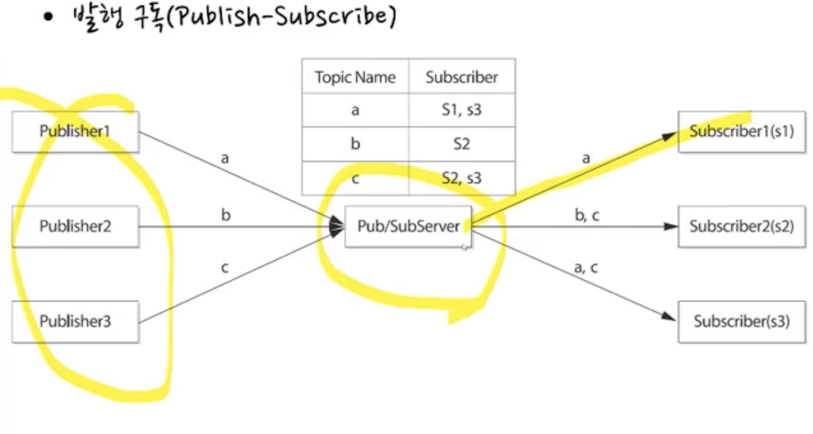|

3. **할당뷰 : 물리 뷰 & 배치 구조** 
   * 하드웨어의 연관관계, 프로세스의 업무 할당시에 사용
   *
      |배치 뷰|파링 구조 뷰|작업 할당 뷰|
      |:--|:--|:--|
      |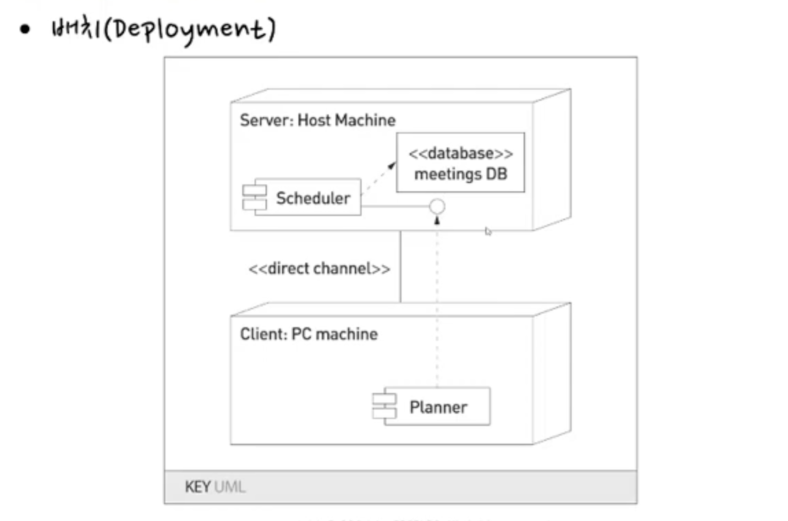 |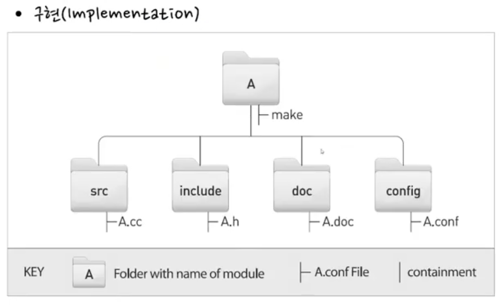 |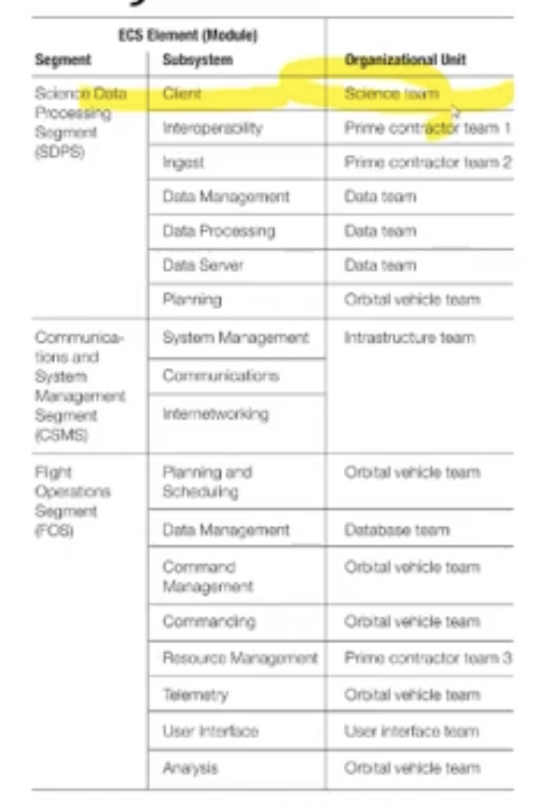 |

#### 2). 뷰 설계 순서

* 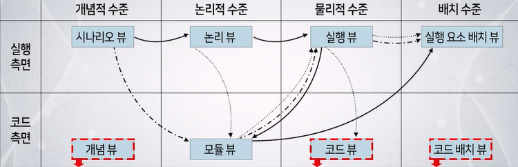

1. 서비스 관점에서는 항상 시나리오 뷰가 제일 최초에 제공된다.
2. 그다음 모듈뷰를 바로 설계할 수 있고, 논리뷰를 통해 모듈뷰를 설계할 수 있다.
3. 그리고 최종적으로 배치뷰에 도달해야한다.

---

### 📄 7. 아키텍처 패턴

패넡을 개선, 조합, 변형 관계를 응용하여 패턴을 효과적으로 사용한다.
패턴은 하나의 독립된것으로 구성되는게 아니라
아키텍쳐에서는 패턴이 서로 연결되고 이어지고 조합되고 변형된다.

#### 1). Publish-subscribe


#### 2). Event-driven
상태 기반 컨트롤러와 제어대상이 되는 여러 컴포넌트로 구성된다.
#### 3). Data-driven
#### 4). Pipes and filters   


   * 서브시스템이 입력 데이터를 받아 처리하고 결과를 다른 시스템에 보내는 작업이 반복되는 아키텍처 스타일 이다. 
   * 재사용성, 확장성이 좋아 다양한 파이프라인 생성가능
   * 데이터변환, 버퍼링, 동기화에 유리함
   * 데이터의 흐름(스트림)의 각 단계를 파이프와 필터로 연결
      ```
      파이프 : 각 단계명 
      필터 : 각 파이프를 통해 넘어온 데이터를 처리하고 캡술홭
      ```
#### 5). Master-Slave
   * 마스터 컴포넌트가 지시한 일을 여러 슬레이브 컴포넌트가 *병렬* 러치하여 결과를 취합
   * 슬레이브가 고장나도 업무 처리에 문제가 없음
   * 실시간 시스템에서 사용되며, 일반적으로 연산 통신 조정을 책임지며, 마스터는 슬레이브 프로세스들을 제어할 수 있다.

#### 6).  Layerd
   * 각각의 상위, 하위 레이어끼리만 상호 작용
   * ex) 네트워크 프로토콜

#### 7). ECS   (Entity-Component-System)
#### 8). MVC   (Observer)


사용자 인터페이스와 시스템간 결합도를 낮추기위한 아키텍처 스타일이다.
* 모델 : 핵심 기능과 데이터 보관
* 컨트롤러 : 입력처리
* 뷰 : 처리된 정보 표시 (여려형태의 뷰)
* 대화형 어플리케이션에 적합
  * ex).  사용자의 요구가 발생하면 시스템이 이를 처리하고 반응하는 소프트웨어

---

## 📕 7. UML 개요

---

#### 1). 객체지향 분석 방법론
* 기획을 클래스와 멤버로 나누어 식별하는것이 목적이다.
객체, 속성, 연산, 관계를정의하고 모델링하는 방법론이다.
그 방법론 중 럼바우 방법을 살펴보자

* **럼바우 분석** : 구성요소를 그림으로 그리자
   1. 객체 모델링 : 멤버와 메서드를 정의하고 객체간 관계를 규정하여 객체 다이어그램으로 표시한다.
   2. 동적 모델링 : 시간의 흐름에 따른 제어흐름, 상호작용, 동작순서같은 행위를 상태도로 표현한다..
   3. 기능 모델링 : 자료흐름도를 사용하여 자료흐름을 중심으로 처리하는 과정을 표현한 모델링

---

### 📄 1. 방법론
프로세스를 어떻게 구현할 것이냐?
1. 구조적 방법론
   * 프로그램 로직 중심  
     * 시스템 전체를 하나의 프로세스로 보고 최상위 레벨의 자료흐름도를 그린다
     * 말단 프로세스의 입력, 출력, 자료구조, 알고리즘을 명시한다.
   * DFD 그림을 그려 요구사항을 분석, 문서화 하는 방법이다.
   * 설계 관심사는 함수위주
   * 설계 핵심은 모듈이다.

2. 객체지향 방법론
   * 유스케이스로 분석하고
   * 자료와 함수를 묶은 클래스를 파악해 상호작용하는 객체들로 시스템을 모델링한다.
   * 설계 관심사는 클래스 위주
   * 설계의 핵심은 객체이다.
      1. 클래스
      2. 멤버와 메서드
      3. 클래스간 관계를 정리하면
      4. 분석자는 모델링 구성요소인 클래스, 객체, 속성, 연산들을 표현해서 문제를 모형화 할 수 있어야 한다.

---

### 📄  2. UML 다이어그램

* 객체 지향 모델링 언어
위에 럼바우 방법론 뿐만 아니라 다양한 객체지향 분석 방법론의 장점을 통함했다.

* UML은 
시스템의 구조를 표현하는 6개의 구조 다이어그램
시스템 동작을 표현하는 7개 행위 다이어그램을 장성 할 수 있다.

* 각 다이어그램은 사물과 사물간의 관계를 용도에 맞게 표현한다.

* 구성요소는 
  1. 사물 (구조, 행동, 그룹, 사물)
  2. 관계 (연관, 집합, 포함, 일반화, 의존, 실체화)
  3. 다이어그램 
     * 구조 : (클래스, 객체, 컴포넌트, 배치, 복합체구조, 패키지)
     * 행위  : (유스케이스, 시퀸스, 커뮤니케이션, State, Activity, Intercatrion Overvew,Timing)
     * 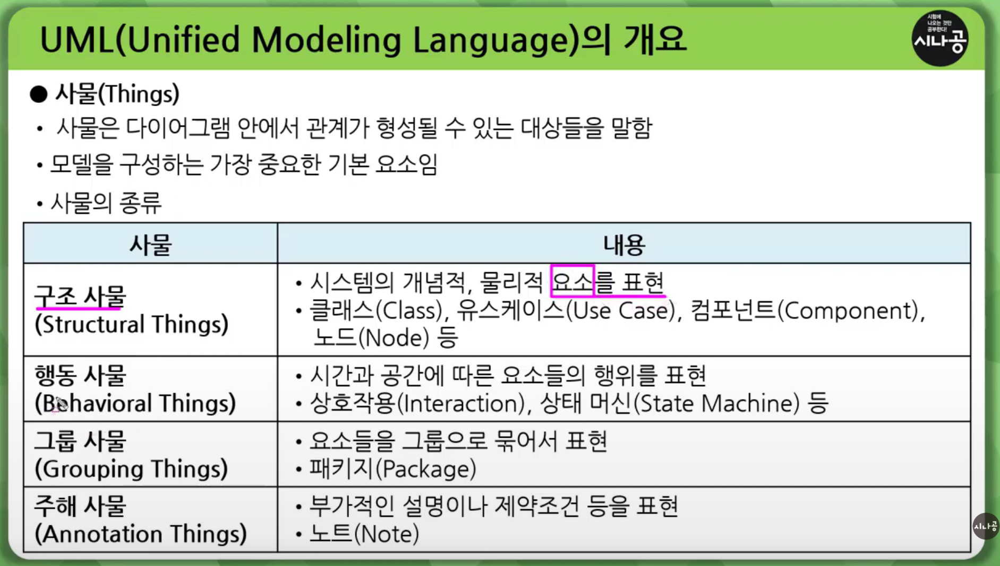
      


### 참고
[OOP 시스템 분석(영어 되면 참고할것)](https://www.youtube.com/watch?v=IzN9Vuoivrg&list=PL6XklZATqYx9dj72MKG6wLYjljeB2odra)
[아키텍처 (쵸코쿠키)](https://jjeongil.tistory.com/category/SW/%ED%81%B4%EB%9D%BC%EC%9A%B0%EB%93%9C%20%EC%84%9C%EB%B9%84%EC%8A%A4%20%EC%95%84%ED%82%A4%ED%85%8D%EC%B2%98)
[정보처리기사](https://y-oni.tistory.com/category/2021%20%EC%A0%95%EB%B3%B4%EC%B2%98%EB%A6%AC%EA%B8%B0%EC%82%AC)
[아키텍처 설계 생명 주기 (프리렉)](https://www.youtube.com/watch?v=_FIWszDGviU&list=PL7mmuO705dG0IAIxnSGZ3N-HsvyA45lte&index=13)
[Used case](https://luv-n-interest.tistory.com/371)
[SEI View Model](https://itwiki.kr/w/SEI_3_%EB%B7%B0)
[아키텍처 - 소프트웨어 공학](https://slidesplayer.org/slide/14682733/)