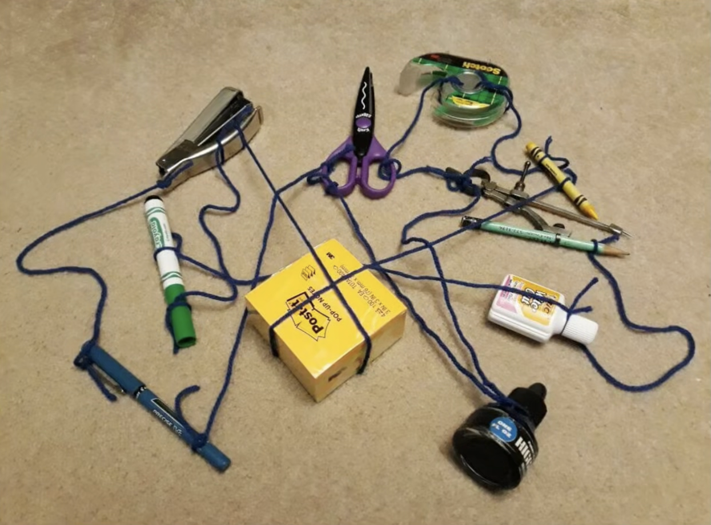
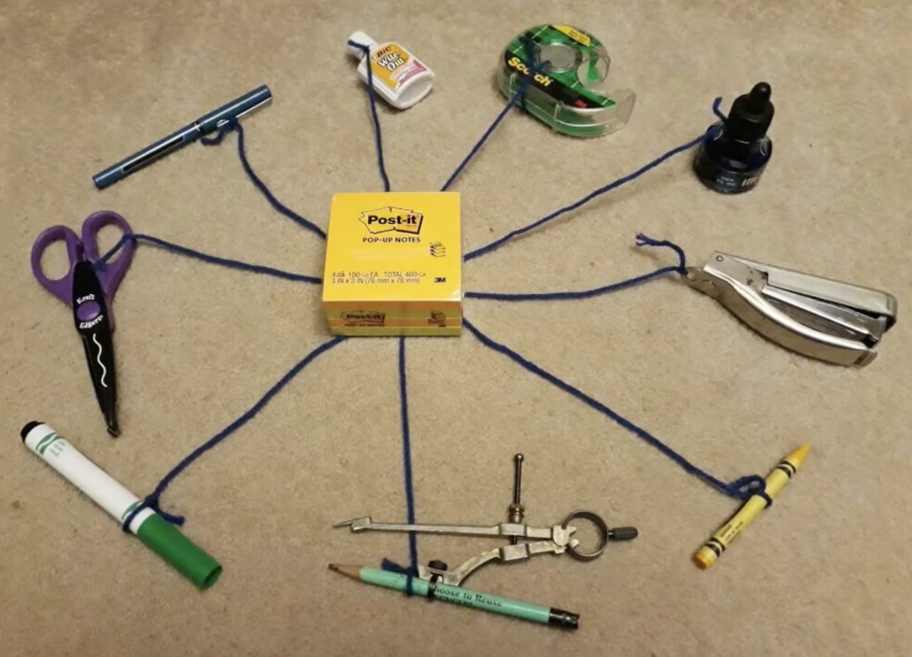
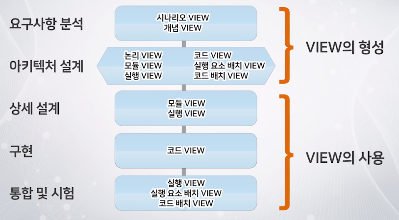
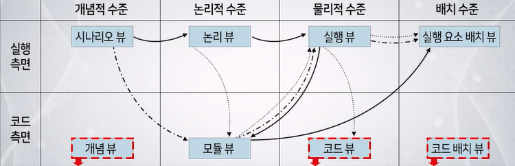

---
ebook:
  theme: github-light.css
  title: 객체지향
  authors: Escatrgot
  disable-font-rescaling: true
  margin: [0.1, 0.1, 0.1, 0.1]
---
<style>
    h3.quest { font-weight: bold; border: 3px solid; color: #A0F !important;}
    .quest { font-weight: bold; color: #A5F !important;}
    h2 { border-top: 12px solid #D40; border-left: 5px solid #D40; border-right: 5px solid #D40; background-color: #D40; color: #FFF !important; font-weight: bold;}
    h3 { border-top: 12px solid #F90; border: 5px solid #F90; background-color: #F90; color: #FFF !important;}
</style>

## 📕 5. NDC의 협업 문화

#### 나의 업무 능력을 복제하는게 목표다.

### 📄 1. 코드 리뷰

#### 1). 업무 분할
1. **자신의 일을 잘라서 나누자**
   * 내가 충분히 알고 있는 일을 나누자 
2. **나눌때, How to를 자세히 설명하자.**
   * 개발 도구 세팅, 사용법
   * 코드를 어디를 봐야하는지
   * 어떤 구조로 문제를 풀면 되는지
   * 쉬운일 부터 완수해야하고 그걸 동료와 공유해야한다.
3. **결과물 확인과 검증 그리고 피드백**
   * 피드백은 일관성 있어야 하고, 근거도 명확해야된다.
   * 한번에 모든 규칙을 숙지하기 어렵기에 ***정리된 문서*** 가 필요하다.
      ```text
      1. 파일, 코드, 클래스명 등등 네이밍 컨벤션
      2. 실행 방법 & 깃허브 공유법 등등..
      3. 디자인 패턴
      4. 델리게이트 네이빙, 호출 컨벤션
      5. 에러메시지 컨벤션
      ```

### 📄 2. 설계 리뷰

1. 기획 사항과 제약 사항을 이해하고 작업을 설계(아키텍처) 해보자
2. 설계 근거를 확인하고 타당성을 검토한다
   * 예상되는 문제를 찾아내고 다른 의견을 제시해본다.
   * 

3. 이렇게 함으로 사고의 흐름, 가치간의 우선순위를 매기고, 
성능 품질 기준의 설정과 비용분석이 가능하다.
4. 설계를 핑퐁하면서 설계를 완성해나가자.

## 6. 아키텍처 & 객체지향 분석 및 설계

### 아키텍처 개요

<div align="center">
	<p>🔻관련 유튜브를 보려면 사진 클릭🔻<p>
	<a href="https://www.youtube.com/watch?v=saxHxoUeeSw"></a>
	<h4>아키텍처에 대한 영상 - 배달의 민족</h4>
</div>


|1|2|
|:--|:--|
|||

#### 1). 아키텍처는 왜 신경쓰는건가?
아키텍처 
   : 소프트 웨에 설계도를 구축하는 방법론 

다시 만들고 고치는 경우가 있다면 비용도, 시간도 손해다.
설계한 아키텍처에 신경쓰지 못한다면 시간이 지날수록 기능을 추가하기 힘들어 진다.
기능을 추가하기위해 기존 소스코드를 바꿔야 하기 때문이다.

#### 2). 그래? 그럼 한번 만들어봐
1. 뭐가 필요한데
   1. 인풋 : 기획서
2. 뭐로 만들고 어떤 아웃풋이 나오는가?
   1. 아웃풋 : 개발 대상 시스템의 아키텍처
   2. 아웃풋 : 유지보수및 관리에 도움을 주는 가이드라인
3. 어떻게 만들어야 잘만든것일까?
   1. 원리
      ```text
      1. 해결해야할 문제를 정제하고 식별하는데 사용되는 3가지 원리
      2. 설계의 결과가 어떤모습을 가져야하는데 사용되는 원리들
      3. 본격적으로 아키텍처 설계에 적용되는 원리다.
         설계활동은 합성과 분석의 방법이고 합성은 경험적 지식과 창의적 아이디어로 수행된다.

      합성에 도움을 주는것은 
         1. 아키텍처 패턴과
            * MVC & Event-Driven(Observer)
            * Entity-Component-System & Data-driven
         2. 품질속성 설계 전략
            A 종속성을 최소화, 의존도를 최소화
            B 추상화 사용 : 더 단순한 인테페이스를 제공
            C 모듈식으로 유지 테스트, 유지보수가 쉽다.
            D 엔티티
            E 테스트가 쉽고 디버깅이 쉽도록
      ```

#### 3). 아키텍처 용어 정리

**① 컴포넌트**

* 시스템을 구성하는것
데이터를 저장하는것
다른 컴포넌트를 연결하는 특수한 케이스

**② 커넥터**

* 컴포넌트간 상호작용을 실행시키는 요소
   ex). Procedure call 또한 커넥터다

**③ 인터페이스**

**④ 관점 & 뷰**

관점 
: 시스템을 포착하기위한 시각
  1. *논리적 관점*  : (컴포넌트-연산혹은처리수행 / 커넥터-단순히그걸연결하는요소)
  2. *모듈 관점*    : (컴포넌트-모듈 / 커넥터-모듈간연결관계)
     * 어떤 코드 모듈로 구성하고 그들이 어떻게 연결되어야하는지 보이는 관점
     * UML에서 지원된다.
     * ***Aggregation 혹은 Composition*** / ***Dependency*** / ***Generalization 혹은 Subclass 관계***
  3. *실행 관점*    : (컴포넌트-프로세스스레드메모리 커넥터-이들을연결하는상호작용방식)

뷰 
: 그 관점에서 본 시스템의 모습
   * 

#### 4). 설계 절차 원리

* 아키텍처는 한번에 만들어지는게 아니라
초기 아키텍처도 있고, 다음 아키텍처를 만드는데 구체적인 요구사항을 파악하는데 이용하기도한다.
그러면서 설계와 동시에 변경및 추가가 수시로 일어나게된다.

* 좋은 아키텍처 설계 절차는 
설계의 일반 원리를 잘 적용한 설계절차
아키텍처 스타일에 맞게 정의된 설계 절차
아키텍처 관점 체계의 여러 뷰의 설계 순서를 명확히 정의한 설계 절차

**① 재귀적인 설계 절차** : 컴포넌트에 대하여 1단계 설계에서 한단계 더 깊이 들어가는 과정을 거쳐 재귀적으로 수행
**② 다관점체계 설계 절차**
뷰 설계 순서
  * 
  * 서비스 관점에서는 항상 시나리오 뷰가 제일 최초에 제공된다.
  * 그다음 모듈뷰를 바로 설계할 수 있고, 논리뷰를 통해 모듈뷰를 설계할 수 있다.
  * 그리고 최종적으로 배치뷰에 도달해야한다.


#### 5). 아키텍쳐 패턴
1. Entity-Component-System
2. Data-Driven
3. Event-Driven
4. MVC (Observer)

Use Case
UML 다이어그램
State 다이어그램
```
개발 VS 아키텍트

1. 객체지향 분석
모델링을 하는 작업이다.
요구사항을 분석하여 요구된 문제와 관련된 
1. 클래스
2. 멤버와 메서드
3. 클래스간 관계를 정리하면

개발하기 위해서는 
1. 객체와 속성, 클래스와 멤버, 전체와 부분등으로 나눠서 분석한다.
2. 분석자는 모델링 구성요소인 클래스, 객체, 속성, 연산들을 표현해서 문제를 모형화 할 수 있어야 한다.
```

---

### 2. 객체지향 분석 방법론
#### 1). 다음과 같은 용도로 사용하자
기획을 클래스와 멤버로 나누어 식별하는것이 목적이다.
객체, 속성, 연산, 관계를정의하고 모델링하는 방법론이다.

그 방법론중 럼바우 방법을 살펴보자
#### 2). 럼바우 분석
구성요소를 그림으로 그리자
객체 모델링 : 멤버와 메서드를 정의하고 객체간 관계를 규정하여 객체 다이어그램으로 표시한다.
동적 모델링 : 시간의 흐름에 따른 제어흐름, 상호작용, 동작순서같은 행위를 상태도로 표현한다..
기능 모델링 : 자료흐름도를 사용한다.
   * 자료 흐름도는 


### 3. UML
#### 1). 개요
* 객체 지향 모델링 언어
* 위에 럼바우 방법론 뿐만 아니라 다양한 객체지향 분석 방법론의 장점을 통함했다.
* 시스템의 구조를 표현하는 6개의 구조 다이어그램, 시스템 동작을 표현하는 7개 행위 다이어그램을 장성 할 수 있다.
* 각 다이어그램은 사물과 사물간의 관계를 용도에 맞게 표현한다.
* 구성요소는 
  1. 사물
  2. 관계
  3. 다이어그램


https://www.youtube.com/watch?v=IzN9Vuoivrg&list=PL6XklZATqYx9dj72MKG6wLYjljeB2odra
https://jjeongil.tistory.com/category/SW/%ED%81%B4%EB%9D%BC%EC%9A%B0%EB%93%9C%20%EC%84%9C%EB%B9%84%EC%8A%A4%20%EC%95%84%ED%82%A4%ED%85%8D%EC%B2%98