---
ebook:
  theme: github-light.css
  title: 객체지향
  authors: Escatrgot
  disable-font-rescaling: true
  margin: [0.1, 0.1, 0.1, 0.1]
---
<style>
    h3.quest { font-weight: bold; border: 3px solid; color: #A0F !important;}
    .quest { font-weight: bold; color: #A5F !important;}
    h2 { border-top: 12px solid #D40; border-left: 5px solid #D40; border-right: 5px solid #D40; background-color: #D40; color: #FFF !important; font-weight: bold;}
    h3 { border-top: 12px solid #F90; border: 5px solid #F90; background-color: #F90; color: #FFF !important;}
</style>


## 📕 6. 다이어그램 작성

---

### 📄 1. 객체지향 분석 방법론
* 기획을 클래스와 멤버로 나누어 식별하는것이 목적이다.
객체, 속성, 연산, 관계를정의하고 모델링하는 방법론이다.
그 방법론 중 럼바우 방법을 살펴보자

* **럼바우 분석** : 구성요소를 그림으로 그리자
   1. 객체 모델링 : 멤버와 메서드를 정의하고 객체간 관계를 규정하여 객체 다이어그램으로 표시한다.
   2. 동적 모델링 : 시간의 흐름에 따른 제어흐름, 상호작용, 동작순서같은 행위를 상태도로 표현한다..
   3. 기능 모델링 : 자료흐름도를 사용하여 자료흐름을 중심으로 처리하는 과정을 표현한 모델링

---

### 📄 2. UML

#### 1). 특징
UML은 모델링 언어다. 시스템, 업무, 산출물를 시각화한다. 소프트웨어 개발에서 청사진에 해당한다.
럼바우 방법론 뿐만 아니라 다양한 객체지향 분석 방법론의 장점을 통함했다.

#### 2). UML 
시스템의 구조를 표현하는 6개의 구조 다이어그램
시스템 동작을 표현하는 7개 행위 다이어그램을 장성 할 수 있다.

* 각 다이어그램은 사물과 사물간의 관계를 용도에 맞게 표현한다.

#### 3). 구성요소 
1. 사물 (구조, 행동, 그룹, 사물)
2. 관계 (연관, 집합, 포함, 일반화, 의존, 실체화)
3. 다이어그램 
   * 구조  : (**클래스**, 객체, 컴포넌트, **배치**, 복합체구조, 패키지)
   * 행위  : (**유스케이스**, **시퀸스**, 커뮤니케이션, **State**, ***Activity***, Intercatrion Overvew,Timing)

#### 4). 중점적으로 다뤄볼 다이어그램은
* "유스케이스 / 클래스 / 시퀸스 / 상태 / 배치" 다이어그램들이다.
* 이걸 그리기 위한 툴은 "루시드 차트 / DrawIo"가 있다.

---

### 📄 3. 다이어그램 툴
#### 0). 종이와 펜 
#### 1). Lucidchart


### 📄 4. 다이어그램의 관계

컴포넌트간 관계를 한눈에 쉽게 보고 의존관계를 파악하는데 사용되는 화살표다.

#### 1). 일반화관계 & 특수화관계 (Generalization & Specialization)

#### 클래스의 상속을 표현한다. "B is A" == "A를 상속한 B"
* 하위 클래스에서 상위인쪽으로 화살표를 연결

<div align="center">
  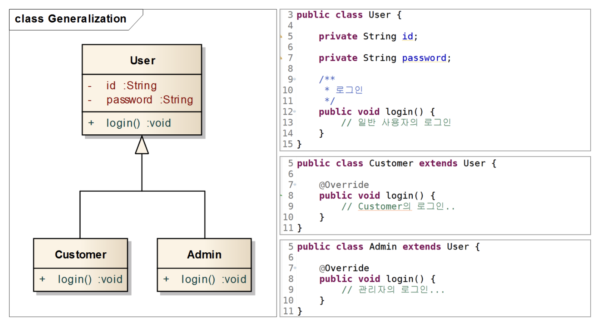
</div>

> **"A_Class, B_Class, C_Class ..." : 서브클래스**들이 여러개 있고. 얘네끼리 비슷한, **공통 멤버를 일반화한 "🅶클래스" : 수퍼클래스**가 있으면..
> * **1. 수퍼클래스 {🅶}**: A, B, C 클래스의 수퍼클래스
> * **2. 서브클래스 {A, B, C, ...}** : 🅶의 자식클래스들

> **그럼 일반화와 특수화는 이런 관계다.**

**① Generalization**
* {A, B, C, ...}(서브 클래스)입장에서 🅶(수퍼클래스)를 표현할때.
수퍼클래스는 서브클래스의 일반화관계임

**② Specialization**
* 🅶(수퍼클래스)입장에서 {A, B, C, ...}(서브 클래스)를 표현할때.
서브클래스들은 수퍼클래스의 특수화관계임
   * *수퍼클래스를 상속 받았다는것은 수퍼클래스이면서 좀더 다른모습으로 "특수화되었다는 얘기"*

#### 2) 실체화관계 (Realization)
####  인터페이스를 상속한 관계라고 할 수 있다. (구현)
* 구현된클래스에서 인터페이스쪽으로 화살표를 연결

<div align="center">
  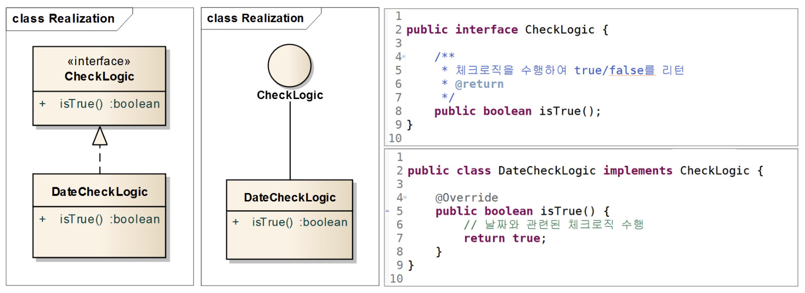
  <h5>DataCheckLogic은 CheckLogic 이란 인터페이스를 상속함</h5>
</div>


#### 3). 의존관계 & 연관관계 (Dependency & Association)
#### 두 클래스에서 한 클래스가 다른 클래스를 참조하는 관계
* "클래스를 참조하는 쪽"에서 "참조 대상"이되는 클래스로 화살표

**① 의존관계**

<div align="center">
  
</div>

**② 연관관계**

<div align="center">
  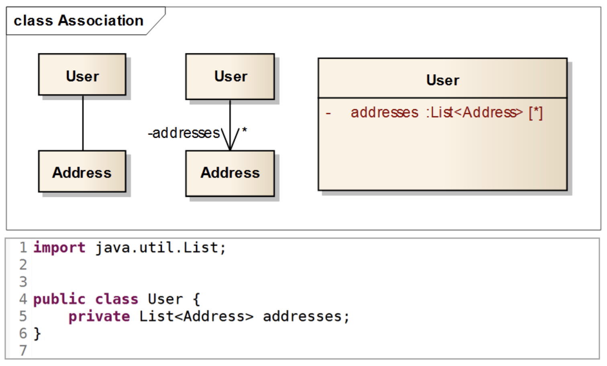
</div>

**③ 공통점**
* 한 클래스가 다른 클래스의 기능을 사용하는점

**④ 차이점**
* 인스턴스 멤버를 가지냐 안가지냐
  * 의존관계는 인스턴스를 멤버로 가지지 않는다. 
    * **① 의존관계의 참조형태 종류**
      1. 객체 생성
      2. 매서드의 매개변수가 객체인 관계
      3. 매서드의 리턴값이 객체인 관계
      4. 객체의 메서드 호출
  * 연관관계는 인스턴스를 멤버로 가진다

#### 4). 집합연관관계 & 컴포지션 연관 관계 (Aggregation & Composition)
#### 연관관계와 같이 한클래스가 다른 클래스를 멤버로 가진다

* 포함하는쪽(Whole) 포함되는쪽(Part) 
* 포함하는쪽으로 마름모를 연결한다.

**① 집합연관관계**

<div align="center">
  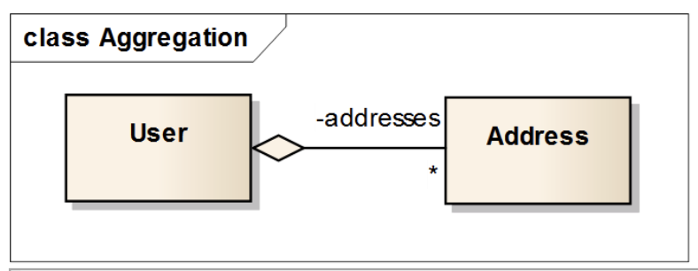
</div>

**② 컴포지션 연관관계**
<div align="center">
  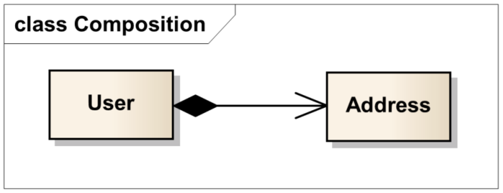
</div>

**③ 공통점**
* 한 클래스가 다른 클래스의 기능을 사용한다.
* 한 클래스가 다른 클래스를 멤버로 가진다.

**④ 차이점**
* 독립적으로 존재할 수 있냐 유무 & 생명주기가 동일하냐?
  * 다음 예시를 보자
    ```
    커뮤니티에 있는 한 게시물에, 댓글을 달았다.
    그 게시물에는 내가 달았던 댓글이 있다.

    어느날 게시물이 삭제되었다..
    case 1  
      게시물이 삭제 되었어도 달았던 댓글의 DB를 확인 할 수 있다.
    case 2 
      게시물이 삭제되면서 내가 달았던 댓글도 전부 삭제되었다.
    -------------------------------------------
    프린터와 컴퓨터   : 집합 연관 관계
    머그컵과 손잡이   : 컴포지션 연관관계
    ```
  * 집합연관관계 : 게시물과 댓글 DB는 독립적으로 존재할 수 있어서 게시물이 삭제되도 댓을 확인할 수는 있었다.
  * 컴포지션연관관계 : 댓글의 생명 주기는 완전히 게시물의 존재 여부에 따라 달려있으며 댓글은 독립적으로 존재할 수 없는 관계일때, 게시물이 삭제되면 댓글도 DB는 커녕 어디에도 따로 존재할 수 없는 상태인 관계이다.
    * whole인스

#### 5). 다중도
**각 컴포넌트간 참조되는 수**

* 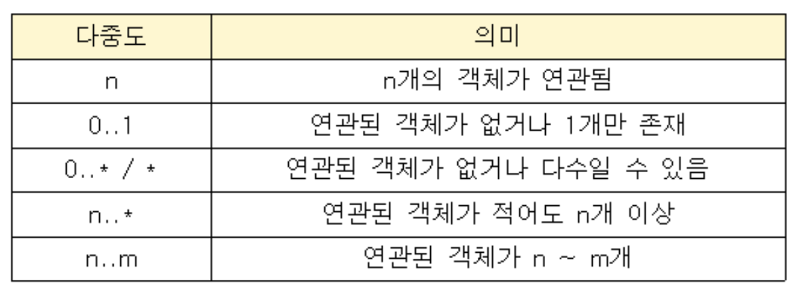
*
  |1 대 1| 다 대 대|
  |---|---|
  |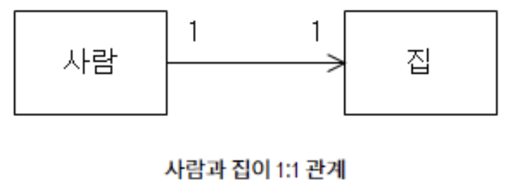|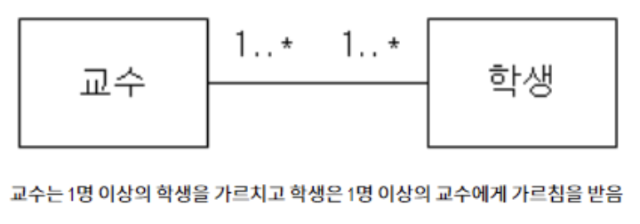|

### 📄 5. 유스케이스 다이어그램

#### 1). 유스케이스
**시스템과 사용자가 상호작용하는 시나리오를 그리는 양식**

<div align="center">
  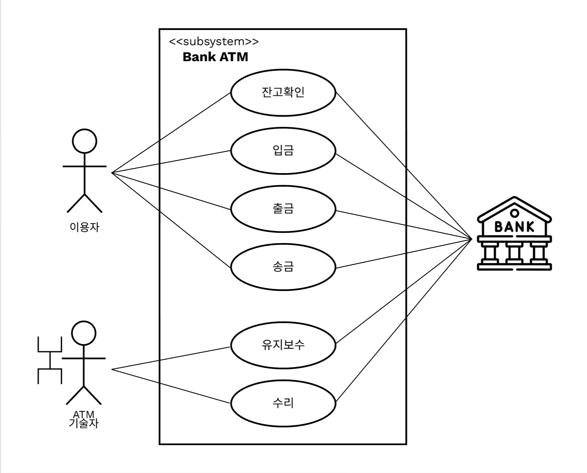
</div>


#### 3). 요소

|요소|설명|
|---|---|
|<h5 style="color:#F40">시스템 범위</h5> |내부 시스템 <br> * 메뉴 시스템, 상점 시스템, 강화 시스템 등등..|
|<h5 style="color:#09F">액터</h5>      |플레이어 또는 외부 시스템(또다른 유스케이스 다이어그램)|
|<h5 style="color:#F6F">유스케이스</h5>  |시스템이 플레이어한테 제공되어야할 서비스 또는 기능|
|<h5 style="color:#BBB">관계</h5>      |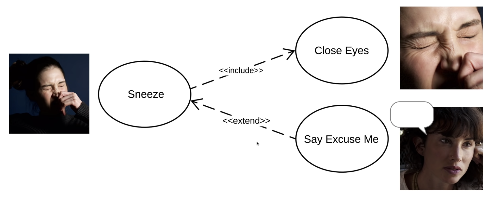<br>유스케이스간 관계 포함관계 확장관계가 있다.<br> * **포함(Include 관계)** : <br>1. "행동A"할때 **반드시 뒤따르는** "행동B"가 있는 관계 (재채기할때 눈을 감는 이벤트가 반드시 뒤따라온다). <br>2. 특정 행동에 대해 이벤트 흐름이 수행 결과에 의존한다.<br>* **확장(Extend 관계)** : <br> 1. "행동A"를 할때 "행동C"을 **할수도 안할수도** 있는 관계 (재채기 하고나서 주변에 사람이 있으면 ㅈㅅㅈㅅ 이럴수도 있는데 집에서 혼자서 그랬으면 안해도 됨) <br>2. 특정 행동 이후의 이벤트 흐름이 수행결과에 의존하지 않는다.|

[개요](https://youtu.be/pekcnviM6bQ)
[LucidChart - Usecase](https://www.youtube.com/watch?v=zid-MVo7M-E&t=722s)

### 📄 6. 클래스 다이어그램
#### 클래스와 클래스가 가지는 멤버, 클래스 사이의 관계를 표현함

<div align="center">
  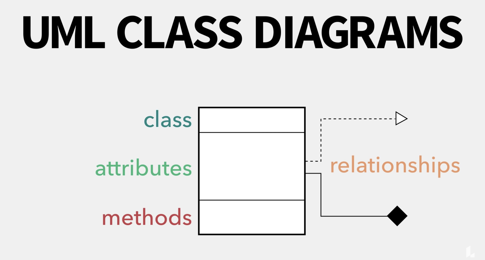
</div>

https://youtu.be/cAD52-br2J0

**① 클래스명**
   * 클래스의 이름
   * 스테레오타입을 적을 수 있다.
      ```
      <<include>> : 연결된 다른 UML 요소에 대해 포함 관계
      <<extend>> : 연결된 다른 UML 요소에 대해 확장 관계
      <<interface>> : 인터페이스를 정의
      <<abstract>> : 추상 클래스
      <<exception>> : 예외를 정의하는 경우
      <<constructor>> : 생성자 역할을 수행하는 경우
      ```

**② 속성**
  * 변수나, 인스턴스 표현
    * +/- AttributeName : Type
  * "﹢" : public
  * "ㅡ" : private

**③ 메소드**
  * 클래스의 메소드 표현
    * +/- Method()
  * "﹢" : public
  * "ㅡ" : private


### 📄 7. 시퀸스 다이어그램
#### 상호작용하는 시스템이나 객체들이 주고받은 메시지를 표현함 
* 각 동작에 참여하는 시스템이나 객체들의 수행기간을 확인 할 수 있음


### 📄 8. 상태 다이어그램
#### 하나의 객체가 자신이 속한 클래스의 상태변화 혹은 다른 객체와의 상호작용에 따라 상태가 어떻게 변화하는지를 표현함 
운영체제 
실행, 준비, 대기
#### 럼바우 객체지향 분석기법에서 동적 모델링에 활용됨

----------

### 참조
https://www.nextree.co.kr/p6753/
https://songkangchan.tistory.com/2
https://www.youtube.com/watch?v=abvh6bKw_SA&list=PL0gFjFO3wHAvBcY58-BwTX38orVwTulXa&index=12