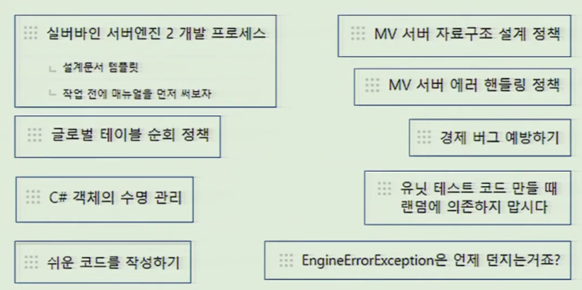

---
ebook:
  theme: github-light.css
  title: 객체지향
  authors: Escatrgot
  disable-font-rescaling: true
  margin: [0.1, 0.1, 0.1, 0.1]
---
<style>
    h3.quest { font-weight: bold; border: 3px solid; color: #A0F !important;}
    .quest { font-weight: bold; color: #A5F !important;}
    h2 { border-top: 12px solid #9D0; border-left: 5px solid #9D0; border-right: 5px solid #9D0; background-color: #9D0; color: #000 !important; font-weight: bold;}
    h3 { border-top: 12px solid #09F; border: 5px solid #09F; background-color: #09F; color: #000 !important;}
</style>


## NDC의 협업 문화

---

### 📄 1. 코드 리뷰

#### 1). 업무 분할
**① 자신의 일을 잘라서 나누자**
* 내가 충분히 알고 있는 일을 나누자 

**② 나눌때, How to를 자세히 설명하자.**
* 개발 도구 세팅, 사용법
코드를 어디를 봐야하는지
어떤 구조로 문제를 풀면 되는지
쉬운일 부터 완수해야하고 그걸 동료와 공유해야한다.

**③ 결과물 확인과 검증 그리고 피드백**

* 피드백은 일관성 있어야 하고, 근거도 명확해야된다.
* 한번에 모든 규칙을 숙지하기 어렵기에 ***정리된 문서*** 가 필요하다.
   ```text
   1. 파일, 코드, 클래스명 등등 네이밍 컨벤션
   2. 실행 방법 & 깃허브 공유법 등등..
   3. 디자인 패턴
   4. 델리게이트 네이빙, 호출 컨벤션
   5. 에러메시지 컨벤션
   ```

---

### 📄 2. 설계 리뷰

1. 기획 사항과 제약 사항을 이해하고 작업을 설계(아키텍처) 해보자
2. 설계 근거를 확인하고 타당성을 검토한다
   * 예상되는 문제를 찾아내고 다른 의견을 제시해본다.
   * 

3. 이렇게 함으로 사고의 흐름, 가치간의 우선순위를 매기고,
성능 품질 기준의 설정과 비용분석이 가능하다.
1. 설계를 핑퐁하면서 설계를 완성해나가자.

---