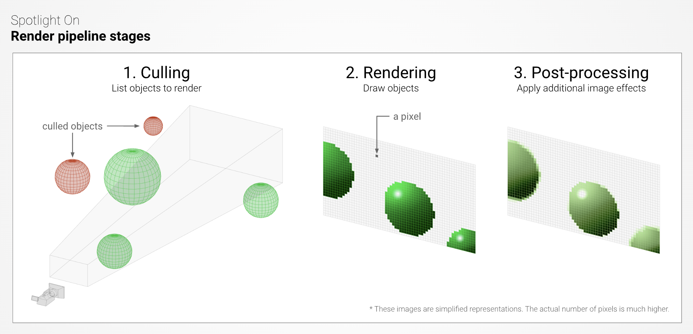
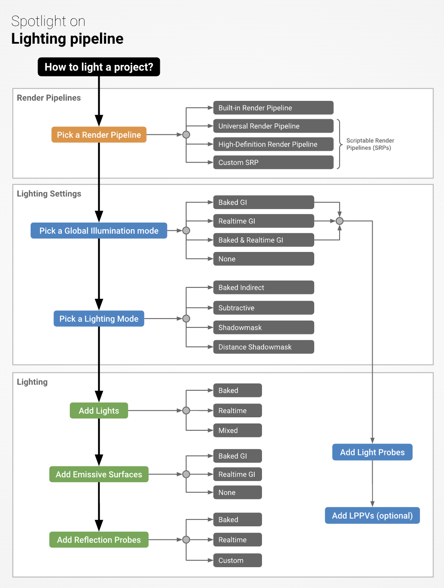
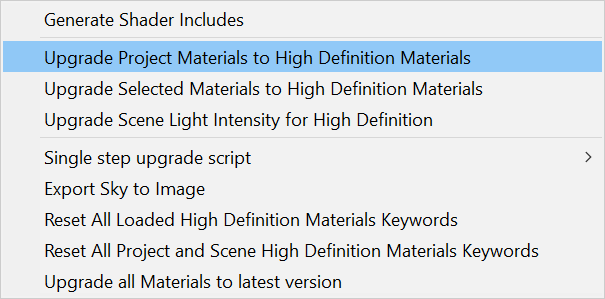

이미 작업했던 프로젝트를 URP 로 변환할 수 있다.

새로운 그래픽 파이프라인이 추가
```
 General 
 Quality 
 Lighting 
 Shadows 
 Post-Processing 
 Advanced 
```

이미 존재하는 메테리얼을 URP 로 변환하기

랜더 파이프라인
1. 랜더 파이프라인은 서로 다른 쉐이더 출력을 사용한다
2. 저마다 다른 기능을 보유한다.

랜더 파이프라인 순서
1. 컬링
   1. Occlusion culling 가려지지 않은것
   2. culled objects 가려진것
2. 렌더링
   * 픽셀 기반 버퍼에 그린다.
3. 포스트 프로세싱
   * 이 버퍼에 대해 컬러 그레이딩, 블룸, 뎁스 오브필드 등 디스플레이에 보낼 최종 출력 프레임을 생성할 수 있다.



쉐이더 
    * GPU 그래픽처리 장치에서 실행되는 프로그램이나
    * 프로그램 컬렉션을 가르킨다.

컬링 단계
버텍스 셰이더 -> 오브젝트 공간 버텍스 좌표를 클립공간이라고 부르는 다른 공간으로 변환한다
그러면 이 클립공간으로 변환 좌표를 레스터화 시킨다.
이 픽셀은 이제 추후 셰이더에 의해 컬러가 지정된다.

간접 조명, 직접 조명, 전역 조명, 래이트 매퍼

### 조명 파이프라인



1. 랜더파이프라인 선택
2. 조명 생성방식 설정,
3. 광원, 발광 표면, 반사 프로브, 라이트 프로브, 라이트 프로브 프록시 볼륨(LPPV)

HDRP 또는 URP로 프로젝트의 머티리얼을 쉽게 포팅할 수 있습니다. 
Edit > Render Pipeline > Upgrade…에서 머티리얼 컨버터를 한 번만 클릭하면 모든 작업이 끝납니다. 단, 이 작업은 되돌릴 수 없습니다. z
반드시 프로젝트를 미리 백업해 두십시오!

