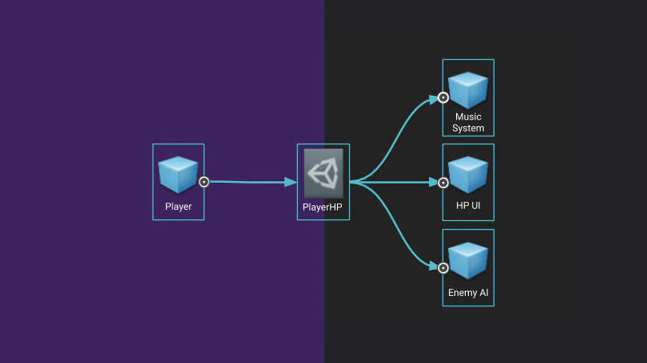

# SciptableObject

#### 플레이웨이트 패턴과 비슷하다.

---

### 개요



대량의 데이터를 저장하고 모든 프리펩들이 그 데이터를 가져와 쓰는 역활

1. 어디에서나 접근 가능한 데이터 
   * 수치적 데이터나, 프리펩 등등을 등록하여 가져다 쓴다.
   * 심지어 이벤트 또한 등록해 전역적에서 이벤트를 가져다 쓸 수 있다.
2. 값의 사본이 생성되는 것을 방지하여 프로젝트의 메모리 사용을 줄이는데 기여하며
3. MonoBehaviour가 아니라서 GameObject에 붙이지 않는다. 파일형태로 저장한다.
4. 스크립터블 오브젝트로 게임 코드를 설계하여 게임 코드를 쉽게 변경하고 디버그하는 방법에 대한 팁입니다.
1. 커플링을 감소시키는데 기여한다.

#### 1. 모둘형 디자인을 사용한다는것..
1. 시스템 간에 하드 레퍼런스를 생성하지 않는 것이 좋습니다. 
2. 씬을 클린 슬레이트로 생성: 씬 간에 임시 데이터가 존재하지 않도록 하세요. 씬을 히트할 때마다 씬이 완전히 브레이크된 후 새로 로드되어야 합니다.
3. 프리팹이 자체적으로 작동하도록 설정하세요. 가능하면 씬으로 드래그하는 모든 프리팹이 각각의 기능을 포함하도록 해야 합니다. 씬이 여러 프리팹으로 구성되며 각 프리팹이 개별적인 기능을 포함하는 경우에 소스를 컨트롤하기가 매우 수월해집니다. 대부분의 체크인이 프리팹 수준에서 이루어져 씬에서 충돌이 감소합니다. 
4. 각 컴포넌트를 한 가지 문제 해결에 집중적으로 사용하세요. 그러면 여러 컴포넌트를 조합하여 새로운 것을 더 쉽게 빌드할 수 있습니다.


#### 2. 변경과 수정이 쉽도록 제작하기
1. 게임을 최대한 데이터 중심적으로 제작하세요.
명령어를 통해 데이터를 처리하는 컴퓨터처럼 게임 시스템을 설계하면, 게임이 실행 중인 경우에도 변경 사항을 게임에 효율적으로 적용할 수 있습니다. 
2. 시스템을 최대한 모듈 및 컴포넌트 기반으로 설정하면 아티스트와 디자이너를 비롯한 사용자가 시스템을 더 쉽게 수정할 수 있습니다. 디자이너가 각각 한 가지 작업만 수행하는 작은 컴포넌트를 구현할 수 있으므로 별도의 기능을 요청할 필요 없이 게임 내 요소를 만들 수 있습니다. 이렇게 되면 디자이너가 구현한 컴포넌트를 다양한 방식으로 조합하여 새로운 게임플레이/메카닉스를 직접 개발할 수도 있습니다.
3. 런타임 시 팀에서 변경 사항을 게임에 적용할 수 있는 것이 중요합니다. 런타임 시 게임을 변경할 수 있는 자유도가 높을수록 안정성과 가치도 높아지며, 스크립터블 오브젝트처럼 런타임 상태를 외부에 다시 저장할 수 있으면 더 좋습니다.
---

### 변수 설계
스크립터블 오브젝트로 빌드할 수 있는 가장 간단한 것 중 하나는 독립적인 에셋 기반 변수입니다.

MonoBehaviour 하나가 FloatVariable 값을 변경하면 다른 MonoBehaviour도 해당 변경 사항을 참조할 수 있다는 점입니다.
시스템 간에 일종의 메시징 레이어가 생성되므로 서로 참조할 필요가 없습니다. 

```cs
public enum PieceType
{
    Pawn, Queen, King, Rook, Bishop, Knight
}

public enum PieceColor
{
    White, Black
}


[CreateAssetMenu(fileName = "GlobalGame", menuName = "ScriptableObjects/GlobalGame", order = int.MaxValue-1)]
public class GlobalGame : SingletonScriptableObject<GlobalGame>
{
    public ComponentBoard GBoard;
    /*ComponentPlayer*/
}
```

#### 예제: 플레이어의 체력 포인트

다른 변수를 쉽게 참조할 수 있습니다.
플레이어가 기록하는 변수와 동일한 변수에서 값을 읽어올 뿐입니다.
이렇게 설정해 두면 PlayerHP와 연동할 요소를 추가하기가 쉽습니다. PlayerHP가 낮아지면 음악이 바뀔 수 있고, 플레이어가 약해진 것을 알면 적의 공격 패턴이 변할 수 있으며, 다음 공격을 받으면 위험하다는 상태를 화면 효과로 알릴 수 있습니다. 
여기서 중요한 것은 플레이어 스크립트에서 이러한 시스템에 메시지를 보내지 않으며, 시스템이 플레이어 게임 오브젝트에 대해 알 필요도 없다는 점입니다.
게임 실행 중에 인스펙터에 들어가서 PlayerHP의 값을 변경할 수도 있습니다. 

### 이벤트 설계
이벤트 시스템입니다. 이벤트 아키텍처는 서로에 대한 직접적인 정보를 갖고 있지 않은 시스템 간에 메시지를 보내 코드를 모듈화하는 데 도움이 됩니다. 이를 통해 업데이트 루프에서 상태 변경을 계속 모니터링하지 않아도 상태 변경에 대응할 수 있습니다.

```cs
[CreateAssetMenu]
public class ScriptableEvent : ScriptableObject
{
	private List<GameEventListener> listeners = 
		new List<GameEventListener>();

    public void Raise()
    {
    	for(int i = listeners.Count -1; i >= 0; i--)
    listeners[i].OnEventRaised();
    }

    public void RegisterListener(GameEventListener listener)
    { listeners.Add(listener); }

    public void UnregisterListener(GameEventListener listener)
    { listeners.Remove(listener); }
}
-----------------------------------------
public class GameEventListener : MonoBehaviour
{
    public ScriptableEvent Event;
    public UnityEvent Response;

    private void OnEnable()
    { Event.RegisterListener(this); }

    private void OnDisable()
    { Event.UnregisterListener(this); }

    public void OnEventRaised()
    { Response.Invoke(); }
}
```

 GameEvent 스크립터블 오브젝트 및 GameEventListener MonoBehaviour의 두 부분으로 구성된 이벤트 시스템입니다. 디자이너는 중요 메시지를 나타내는 GameEvent를 프로젝트에 생성하여 보낼 수 있습니다. 


#### InventoryManager를 DontDestroyOnLoad MonoBehaviour에 두는 대신 스크립터블 오브젝트에 둘 수도 있습니다.

---

이벤트를 가지고 있는 객체를 직접 참조해 이벤트를 등록하고 사용하다보니 문제점이 있었습니다. (객체간 의존성이 강해진다.)
 
프로젝트의 규모가 커지고 사용하는 클래스가 늘어날 수록 이벤트 때문에 각 클래스 간의 의존성이 강해진다는 문제가 있었습니다. 어떤 객체가 다른 객체의 호출하는 이벤트를 리슨하기 위해서는 결국 해당 객체에서 이벤트를 호출하는 객체를 알아야 할 수 밖에 없습니다. 

### 생산성을 높이는 Event 사용 방법
Scriptable Object를 활용한 이벤트 관리 방법을 선호합니다.  에셋 형태로 사용되는 오브젝트입니다. 게임이 실행될 때 같이 메모리에 로드됩니다. 주로 런타임에 변경되지 않는 데이터를 저장하는 데에 사용하면 유용한 오브젝트인데요,

ZOOPORTS 프로젝트에서는 멀티플레이 프로젝트에 맞게 서버, 클라이언트, 로컬의 상황마다 호출/등록 할 수 있는 이벤트와 리스너 클래스를 만들어 사용했습니다.

```cs
using System.Collections;
using System.Collections.Generic;
using UnityEngine;

namespace Zooports.Event
{
    [CreateAssetMenu(fileName = "NewEventCaller", menuName = "ZOOPORTS/ScriptableObj/Event/EventCaller", order = 1)]
    public class MirageNetworkEventCaller : ScriptableObject 
    {
        private List<MirageNetworkEventListener> _serverListeners = new List<MirageNetworkEventListener>();
        private List<MirageNetworkEventListener> _clientListeners = new List<MirageNetworkEventListener>();
        private List<MirageNetworkEventListener> _localListeners = new List<MirageNetworkEventListener>();

        /// <summary>
        /// 서버를 대상으로 이벤트를 호출
        /// </summary>
        public void OnServerRaise()
        {
            for (int i = _serverListeners.Count - 1; i >= 0; i--)
                _serverListeners[i].OnEventRaised();
        }

        public void OnServerRegisterListener(MirageNetworkEventListener listener)
        { _serverListeners.Add(listener); }

        public void OnServerUnregisterListener(MirageNetworkEventListener listener)
        { _serverListeners.Remove(listener); }

        /// <summary>
        /// 모든 클라이언트를 대상으로 이벤트를 호출
        /// </summary>
        public void OnClientRaise()
        {
            for (int i = _clientListeners.Count - 1; i >= 0; i--)
                _clientListeners[i].OnEventRaised();
        }

        public void OnClientRegisterListener(MirageNetworkEventListener listener)
        { _clientListeners.Add(listener); }

        public void OnClientUnregisterListener(MirageNetworkEventListener listener)
        { _clientListeners.Remove(listener); }

        /// <summary>
        /// 로컬 플레이어를 대상으로 이벤트를 호출
        /// </summary>
        public void OnLocalClientRaise()
        {
            for (int i = _localListeners.Count - 1; i >= 0; i--)
                _localListeners[i].OnEventRaised();
        }

        public void OnLocalClientRegisterListener(MirageNetworkEventListener listener)
        { _localListeners.Add(listener); }

        public void OnLocalClientUnregisterListener(MirageNetworkEventListener listener)
        { _localListeners.Remove(listener); }
    }
}
```

```cs
using System.Collections;
using System.Collections.Generic;
using UnityEngine;
using UnityEngine.Events;
using UnityEngine.Serialization;
using Zooports.Data;
using Mirage;

namespace Zooports.Event
{
    public class MirageNetworkEventListener : MonoBehaviour
    {
#if UNITY_EDITOR
        [Header("DEV")]
        [FormerlySerializedAs("Comment")]
        public string DEVComment;
#endif

        [Header("Event Setting")]
        [FormerlySerializedAs("Event Listener Type")]
        [SerializeField] EventListenerType EventListenerType;
        public MirageNetworkEventCaller Event;
        public UnityEvent Response;

        void OnEnable()
        {
            switch (EventListenerType)
            {
                case EventListenerType.Server:
                    Event.OnServerRegisterListener(this);
                    break;
                case EventListenerType.Client:
                    Event.OnClientRegisterListener(this);
                    break;
                case EventListenerType.Local:
                    Event.OnLocalClientRegisterListener(this);
                    break;
            }
        }
        void OnDisable()
        {
            switch (EventListenerType)
            {
                case EventListenerType.Server:
                    Event.OnServerUnregisterListener(this);
                    break;
                case EventListenerType.Client:
                    Event.OnClientUnregisterListener(this);
                    break;
                case EventListenerType.Local:
                    Event.OnLocalClientUnregisterListener(this);
                    break;
            }
        }

        public void OnEventRaised()
        { Response.Invoke(); }
    }
}
```

-------------

### 참고
1. https://docs.unity3d.com/kr/2022.2/Manual/class-ScriptableObject.html

2. https://wergia.tistory.com/189

3. https://unity.com/kr/how-to/architect-game-code-scriptable-objects

https://medium.com/wardgames/unity-scriptable-object%EB%A5%BC-%EC%9D%B4%EC%9A%A9%ED%95%9C-%EC%9D%B4%EB%B2%A4%ED%8A%B8-%EC%B2%98%EB%A6%AC-b689a0c27c46


